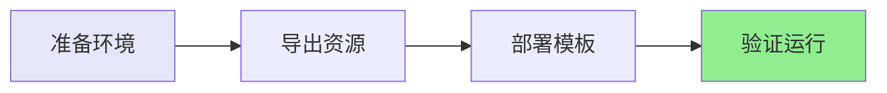

# 快速开始指南

## ⚡ 5分钟完成部署



## 📋 前置条件

```bash
# 1. 检查AWS CLI
aws --version  # 需要 >= 2.0

# 2. 配置凭证
aws configure

# 3. 验证权限
aws sts get-caller-identity
```

## 🚀 三步部署

### 步骤1: 导出现有资源 (1分钟)

```bash
# 克隆仓库
git clone <repository-url>
cd aws-glue-automation

# 执行导出
./scripts/export-glue-to-cloudformation.sh <工作流名称> <AWS配置> <区域>

# 示例
./scripts/export-glue-to-cloudformation.sh helloworld default us-east-1
```

**输出**:
```
✅ 工作流导出成功
✅ 作业导出成功: helloworld-job
✅ 触发器导出成功: helloworld-trigger
✅ 脚本下载成功
🔨 自动生成CloudFormation模板...
✅ CloudFormation模板生成完成！
```

### 步骤2: 部署到目标账号 (3分钟)

```bash
aws cloudformation deploy \
  --template-file cloudformation-export/generated-cloudformation.yaml \
  --stack-name glue-workflow-stack \
  --capabilities CAPABILITY_IAM \
  --profile <target-profile> \
  --region <target-region>
```

### 步骤3: 启动工作流 (1分钟)

```bash
# 启动工作流
aws glue start-workflow-run --name helloworld-dev

# 查看状态
aws glue get-workflow --name helloworld-dev
```

## ✅ 验证成功

```bash
# 检查堆栈状态
aws cloudformation describe-stacks --stack-name glue-workflow-stack

# 查看工作流运行历史
aws glue get-workflow-run --name helloworld-dev --run-id <run-id>
```

## 🎯 完整示例

```bash
# 完整命令序列
./scripts/export-glue-to-cloudformation.sh helloworld default us-east-1

aws cloudformation deploy \
  --template-file cloudformation-export/generated-cloudformation.yaml \
  --stack-name glue-helloworld \
  --capabilities CAPABILITY_IAM

aws glue start-workflow-run --name helloworld-dev
```

## 📊 时间估算

| 步骤 | 时间 |
|------|------|
| 导出资源 | ~1分钟 |
| 部署模板 | ~3分钟 |
| 启动验证 | ~1分钟 |
| **总计** | **~5分钟** |

## ❓ 遇到问题？

查看 [使用指南](docs/GUIDE.md) 的常见问题部分。

## 🔗 下一步

- 📖 阅读 [详细文档](docs/GUIDE.md)
- 🏗️ 了解 [技术架构](docs/ARCHITECTURE.md)
- 🎯 查看 [示例](examples/helloworld)
- 🔑 学习 [Prompt重现](docs/PROMPTS.md)

---

**需要帮助？** 提交 [Issue](../../issues) 或查看 [文档](docs/)
