# 快速开始指南

## ⚡ 2分钟完成部署（智能自动生成）

```mermaid
graph LR
    A[准备环境] --> B[智能生成]
    B --> C[部署模板]
    C --> D[验证运行]
    
    style A fill:#E6E6FA
    style B fill:#FFD700
    style D fill:#90EE90
```



## 📋 前置条件

```bash
# 1. 检查AWS CLI
aws --version  # 需要 >= 2.0

# 2. 配置凭证
aws configure

# 3. 验证权限
aws sts get-caller-identity
```

## 🚀 方式一: 智能自动生成（推荐 🌟）

### 一键生成 CloudFormation 模板

```bash
# 克隆仓库
git clone <repository-url>
cd AWS-Glue-workflow-automation-deployment-solution

# 智能自动生成（自动检测复杂度并选择最佳方法）
./scripts/auto-generate-cloudformation.sh <工作流名称> <AWS配置> <区域>

# 示例
./scripts/auto-generate-cloudformation.sh my-workflow default us-east-1
```

**特点**:
- ✅ 智能检测项目复杂度（简单/中等/复杂）
- ✅ 自动选择最佳模板生成方法
- ✅ 生成标准化的 `cloudformation.yaml`
- ✅ 包含完整的部署文档
- ✅ 2分钟内完成

**输出**:
```
🔍 智能资源发现...
   ✅ 找到工作流: my-workflow
   ✅ 找到 3 个作业
   ✅ 找到 3 个触发器

🎯 项目复杂度评估...
   复杂度级别: 中等
   推荐方法: CLI + Bash 脚本（增强版）

📦 导出资源配置...
   ✅ 工作流配置已保存
   ✅ 作业 1-3 已导出

🔨 生成 CloudFormation 模板...
   ✅ CloudFormation 模板已生成

📝 生成文档和摘要...
   ✅ 部署摘要已生成
   ✅ 资源摘要已生成

✅ 完成！
```

### 部署到目标账号

```bash
# 部署
aws cloudformation deploy \
  --template-file cloudformation-export/cloudformation.yaml \
  --stack-name my-workflow-dev-stack \
  --capabilities CAPABILITY_IAM \
  --parameter-overrides \
      Environment=dev \
      ProjectName=my-workflow \
  --profile <target-profile> \
  --region <target-region>
```

### 启动工作流

```bash
# 启动
aws glue start-workflow-run --name my-workflow-dev

# 查看状态
aws glue get-workflow --name my-workflow-dev
```

---

## 🚀 方式二: 传统三步部署

### 步骤1: 导出现有资源 (1分钟)

```bash
# 克隆仓库
git clone <repository-url>
cd aws-glue-automation

# 执行导出
./scripts/export-glue-to-cloudformation.sh <工作流名称> <AWS配置> <区域>

# 示例
./scripts/export-glue-to-cloudformation.sh helloworld default us-east-1
```

**输出**:
```
✅ 工作流导出成功
✅ 作业导出成功: helloworld-job
✅ 触发器导出成功: helloworld-trigger
✅ 脚本下载成功
🔨 自动生成CloudFormation模板...
✅ CloudFormation模板生成完成！
```

### 步骤2: 部署到目标账号 (3分钟)

```bash
aws cloudformation deploy \
  --template-file cloudformation-export/generated-cloudformation.yaml \
  --stack-name glue-workflow-stack \
  --capabilities CAPABILITY_IAM \
  --profile <target-profile> \
  --region <target-region>
```

### 步骤3: 启动工作流 (1分钟)

```bash
# 启动工作流
aws glue start-workflow-run --name helloworld-dev

# 查看状态
aws glue get-workflow --name helloworld-dev
```

## ✅ 验证成功

```bash
# 检查堆栈状态
aws cloudformation describe-stacks --stack-name glue-workflow-stack

# 查看工作流运行历史
aws glue get-workflow-run --name helloworld-dev --run-id <run-id>
```

## 🎯 完整示例

```bash
# 完整命令序列
./scripts/export-glue-to-cloudformation.sh helloworld default us-east-1

aws cloudformation deploy \
  --template-file cloudformation-export/generated-cloudformation.yaml \
  --stack-name glue-helloworld \
  --capabilities CAPABILITY_IAM

aws glue start-workflow-run --name helloworld-dev
```

## 📊 时间估算

### 智能自动生成方式
| 步骤 | 时间 |
|------|------|
| 智能生成模板 | ~2分钟 |
| 部署模板 | ~3分钟 |
| 启动验证 | ~1分钟 |
| **总计** | **~6分钟** |

### 传统方式
| 步骤 | 时间 |
|------|------|
| 导出资源 | ~1分钟 |
| 部署模板 | ~3分钟 |
| 启动验证 | ~1分钟 |
| **总计** | **~5分钟** |

## ❓ 遇到问题？

查看 [使用指南](docs/GUIDE.md) 的常见问题部分。

## 🔗 下一步

- 🌟 [自动生成方法完整指南](docs/AUTO_GENERATION_METHODS.md) - **新功能详解**
- 📖 阅读 [详细文档](docs/GUIDE.md)
- 📚 查看 [CloudFormation 打包方法指南](docs/CLOUDFORMATION_PACKAGING_GUIDE.md)
- 🏗️ 了解 [技术架构](docs/ARCHITECTURE.md)
- 🎯 查看 [示例](examples/helloworld)
- 🔑 学习 [Prompt重现](docs/PROMPTS.md)

---

**需要帮助？** 提交 [Issue](../../issues) 或查看 [文档](docs/)
