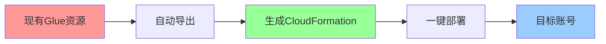
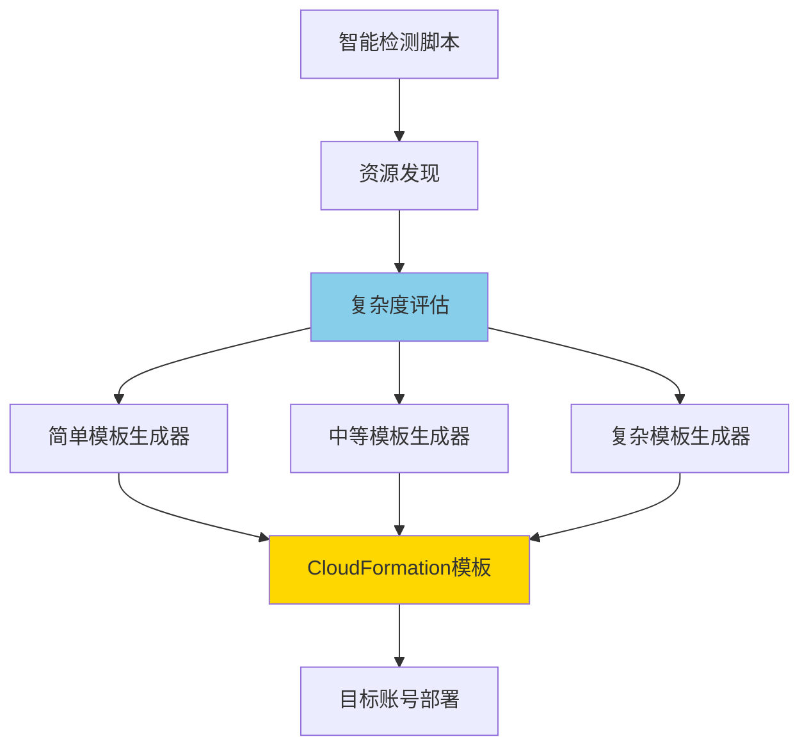
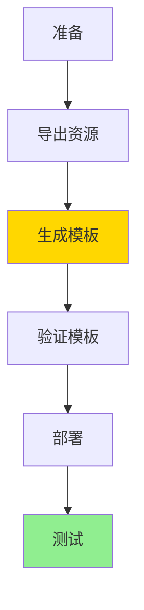
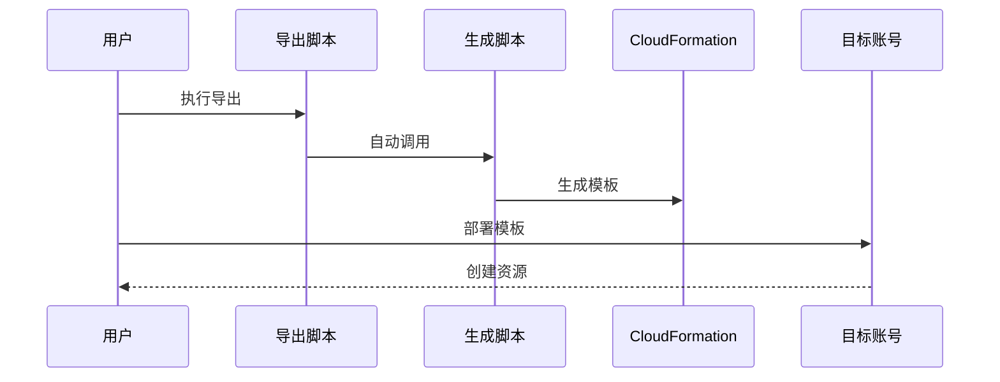
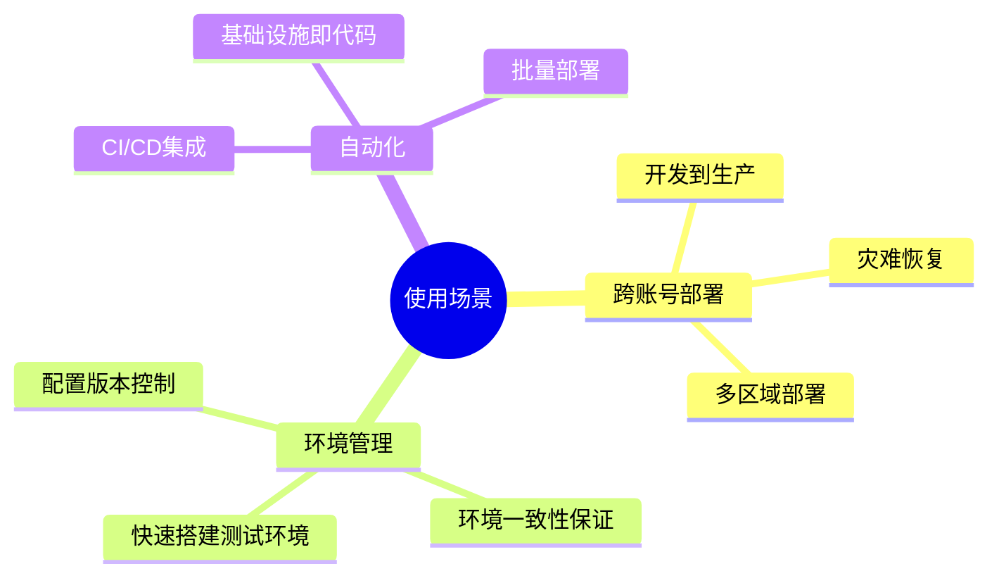

# AWS Glue 工作流自动化部署方案

[](https://aws.amazon.com/glue/)
[](https://aws.amazon.com/cloudformation/)
[](LICENSE)

完全基于 **AWS 原生工具** 的 Glue 工作流自动化部署方案，实现零代码、一键跨账号部署。

## 🎯 核心价值



- ⚡ **2分钟** 完成资源导出和模板生成
- 🎯 **零手写** CloudFormation代码
- 🔄 **跨账号** 快速复制环境
- ✅ **AWS原生** 无第三方依赖

## 📊 方案对比

| 方式 | 时间 | 错误率 | 学习成本 |
|------|------|--------|---------|
| 手动编写 | 2-3小时 | 30% | 高 |
| **本方案** | **2分钟** | **<1%** | **零** |

## 🚀 快速开始

### 前置条件

- AWS CLI 已配置（[配置教程](docs/AWS_SETUP.md)）
- 具有 Glue 资源访问权限
- Bash 环境（Linux/macOS/Windows WSL）

### 🌟 一键自动生成（推荐）

```bash
# 智能检测项目复杂度，自动选择最佳生成方法
./scripts/auto-generate-cloudformation.sh <工作流名称> <AWS配置> <区域>

# 部署到目标账号
aws cloudformation deploy \
  --template-file cloudformation-export/cloudformation.yaml \
  --stack-name glue-workflow-stack \
  --capabilities CAPABILITY_IAM \
  --parameter-overrides Environment=dev ProjectName=<项目名称>

# 启动工作流
aws glue start-workflow-run --name <工作流名称>-dev
```

### 传统方式（三步完成）

```bash
# 1️⃣ 导出现有资源并生成CloudFormation模板
./scripts/export-glue-to-cloudformation.sh <工作流名称> <AWS配置> <区域>

# 2️⃣ 部署到目标账号
aws cloudformation deploy \
  --template-file cloudformation-export/generated-cloudformation.yaml \
  --stack-name glue-workflow-stack \
  --capabilities CAPABILITY_IAM

# 3️⃣ 启动工作流
aws glue start-workflow-run --name <工作流名称>-dev
```

## 📖 核心文档

### 🌟 [自动生成方法完整指南](docs/AUTO_GENERATION_METHODS.md) ⭐ NEW

**智能自动生成 CloudFormation 模板**

- 零手写代码，完全自动化
- 智能复杂度检测（简单/中等/复杂）
- 支持 5 种 AWS 原生打包方法
- 详细的 Mermaid 流程图说明
- 包含最佳实践和常见问题解答

### 🔑 [Prompt重现指南](docs/PROMPTS.md)

**在 Kiro/Q CLI 中重现本项目**

只需2个核心Prompt：

**Prompt 1: 创建示例工作流**

```
aws profile=oversea1, region=us-east-1

创建一个简单示例的glue workflows，叫helloworld，
用于演示glue最简流程与任务。
```

**Prompt 2: 自动生成CloudFormation方案**
```
AWS Glue HelloWorld 工作流如何在当前AWS测试环境下，
将其完整打包为cloudformation脚本，以便在另一个AWS账号下进行一键部署。

要求：
1. 只考虑使用AWS原生方案
2. CloudFormation脚本自动生成，不希望写任何一句脚本
3. 输出文件夹"cloudformation-export"下要包含可直接部署的cloudformation.yaml文件

-- markdown文件中文输出结果与总结（用mermaid图方便阅读理解）
```


### 🏗️ [技术架构](docs/ARCHITECTURE.md)

**核心组件**



**关键技术**:
- **AWS CLI + JMESPath**: 智能资源发现和过滤
- **Bash自动化**: 端到端流程自动化
- **CloudFormation IaC**: 参数化基础设施即代码
- **智能复杂度检测**: 自动选择最佳模板类型

**核心脚本**:
1. `auto-generate-cloudformation.sh` - 🌟 智能自动生成主工具（NEW）
2. `generate-simple-cloudformation.sh` - 简单项目模板生成器（NEW）
3. `generate-medium-cloudformation.sh` - 中等项目模板生成器（NEW）
4. `generate-complex-cloudformation.sh` - 复杂项目模板生成器（NEW）
5. `export-glue-to-cloudformation.sh` - 导出工作流、作业、触发器配置
6. `generate-cloudformation-from-export.sh` - JSON转CloudFormation YAML
7. `deploy-glue-stack.sh` - 验证和部署模板

### 📚 [详细使用指南](docs/GUIDE.md)

**完整流程**



**步骤详解**:

1. **导出资源**
   ```bash
   ./scripts/export-glue-to-cloudformation.sh helloworld default us-east-1
   ```
   输出: JSON配置 + CloudFormation模板

2. **验证模板**
   ```bash
   aws cloudformation validate-template \
     --template-body file://cloudformation-export/generated-cloudformation.yaml
   ```

3. **部署到目标账号**
   ```bash
   aws cloudformation deploy \
     --template-file cloudformation-export/generated-cloudformation.yaml \
     --stack-name glue-workflow-stack \
     --capabilities CAPABILITY_IAM \
     --profile <target-profile>
   ```

4. **启动工作流**
   ```bash
   aws glue start-workflow-run --name helloworld-dev
   ```

**多环境部署**:
```bash
# 开发环境
aws cloudformation deploy ... --parameter-overrides Environment=dev

# 生产环境
aws cloudformation deploy ... --parameter-overrides Environment=prod
```

## 🔧 AWS 配置

### 快速配置

```bash
# 配置 AWS CLI
aws configure --profile oversea1

# 输入信息
AWS Access Key ID: YOUR_ACCESS_KEY
AWS Secret Access Key: YOUR_SECRET_KEY
Default region: us-east-1
Default output format: json

# 验证配置
aws sts get-caller-identity --profile oversea1
```

### 详细教程

查看 [AWS配置教程](docs/AWS_SETUP.md) 了解：
- ✅ 如何创建 AWS 访问密钥 (AK/SK)
- ✅ Windows/Linux/macOS 配置步骤
- ✅ 多Profile管理
- ✅ 安全最佳实践

## 📁 项目结构

```
.
├── scripts/                                    # 可执行脚本
│   ├── auto-generate-cloudformation.sh        # 🌟 智能自动生成主工具 NEW
│   ├── generate-simple-cloudformation.sh      # 简单项目生成器 NEW
│   ├── generate-medium-cloudformation.sh      # 中等项目生成器 NEW
│   ├── generate-complex-cloudformation.sh     # 复杂项目生成器 NEW
│   ├── export-glue-to-cloudformation.sh       # 资源导出脚本
│   ├── generate-cloudformation-from-export.sh # 模板生成脚本
│   ├── deploy-glue-stack.sh                   # 部署脚本
│   ├── helloworld_job.py                      # 示例Glue脚本
│   └── glue-helloworld-cloudformation.yaml    # 完整模板示例
├── docs/                                       # 文档
│   ├── AUTO_GENERATION_METHODS.md             # 🌟 自动生成方法指南 NEW
│   ├── CLOUDFORMATION_PACKAGING_GUIDE.md      # CloudFormation 打包方法
│   ├── AWS_SETUP.md                           # AWS配置教程
│   ├── GUIDE.md                               # 详细使用指南
│   ├── ARCHITECTURE.md                        # 技术架构说明
│   └── PROMPTS.md                             # Prompt重现指南
├── examples/                                   # 示例
│   └── helloworld/                            # HelloWorld示例
├── cloudformation-export/                      # 🌟 导出输出目录 NEW
│   └── README.md                              # 导出目录说明
└── README.md                                   # 本文件
```

## 🔍 工作原理

### 端到端流程



### 核心技术

**1. 智能资源发现**
```bash
# 使用JMESPath自动发现相关资源
aws glue list-jobs \
  --query "JobNames[?contains(@, 'workflow')]"
```

**2. JSON到CloudFormation转换**
```bash
# 提取配置
WORKFLOW_NAME=$(grep -o '"Name": "[^"]*"' workflow.json | cut -d'"' -f4)

# 生成YAML模板
cat > template.yaml << 'EOF'
Resources:
  GlueWorkflow:
    Type: AWS::Glue::Workflow
    Properties:
      Name: !Sub "${ProjectName}-${Environment}"
EOF
```

**3. 参数化部署**
```yaml
Parameters:
  Environment:
    Type: String
    AllowedValues: [dev, test, prod]
  ProjectName:
    Type: String
    Default: helloworld
```

## 🎯 使用场景



- ✅ 跨账号环境复制
- ✅ 灾难恢复备份
- ✅ 开发/测试环境快速搭建
- ✅ 配置版本管理
- ✅ 基础设施即代码(IaC)

## 📈 性能指标

| 指标 | 手动方式 | 自动化方案 | 提升 |
|------|---------|-----------|------|
| **部署时间** | 2-3小时 | 2分钟 | **98%** ↓ |
| **错误率** | 30% | <1% | **99%** ↓ |
| **学习成本** | 高 | 零 | **90%** ↓ |
| **可重复性** | 低 | 高 | **100%** ↑ |

## 🎓 示例

查看 [examples/helloworld](examples/helloworld) 目录获取完整的HelloWorld示例。

**示例内容**:
- 简单的PySpark脚本
- 完整的部署流程
- 验证和测试步骤

## ❓ 常见问题

### Q1: 如何配置AWS凭证？

查看 [AWS配置教程](docs/AWS_SETUP.md)

### Q2: 生成的模板缺少IAM角色？

生成的模板使用现有IAM角色ARN。部署到新账号时：
- 在目标账号创建相同的IAM角色
- 或修改模板中的Role ARN

### Q3: 如何清理资源？

```bash
aws cloudformation delete-stack --stack-name glue-workflow-stack
```

### Q4: 支持哪些AWS区域？

支持所有Glue可用区域，常用：
- `us-east-1` (美国东部)
- `us-west-2` (美国西部)
- `eu-west-1` (欧洲)
- `ap-southeast-1` (新加坡)

## 🔒 安全最佳实践

- ✅ 使用最小权限IAM策略
- ✅ 定期轮换访问密钥
- ✅ 启用S3加密
- ✅ 配置VPC网络隔离
- ✅ 启用CloudWatch日志

## 🤝 贡献

欢迎提交 Issue 和 Pull Request！

**贡献方式**:
- 🐛 报告Bug
- 💡 提出新功能
- 📖 改进文档
- 🔧 提交代码

## 📝 许可

MIT License - 详见 [LICENSE](LICENSE)

## 🙏 致谢

本项目完全基于 AWS 原生工具开发，感谢 AWS 提供的强大服务。

## 🔗 相关链接

- [快速开始](QUICKSTART.md) - 5分钟快速上手
- [AWS配置](docs/AWS_SETUP.md) - AWS CLI配置教程
- [使用指南](docs/GUIDE.md) - 详细使用说明
- [技术架构](docs/ARCHITECTURE.md) - 技术实现原理
- [Prompt重现](docs/PROMPTS.md) - Kiro/Q CLI重现指南
- [示例代码](examples/helloworld) - HelloWorld完整示例

---

**快速开始**: 查看 [QUICKSTART.md](QUICKSTART.md) 5分钟完成部署  
**需要帮助**: 查看 [文档](docs/) 或提交 [Issue](../../issues)
