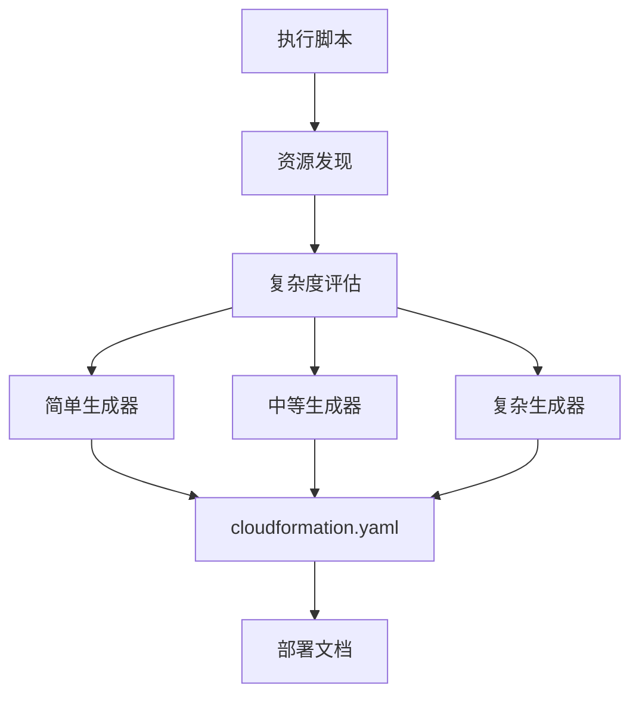

# 版本发布说明

## 🎉 v2.0.0 - 智能自动生成增强版 (2025-12-18)

### ✨ 重大更新

#### 1. 智能自动生成系统 🌟

**新增智能主工具**:
- `scripts/auto-generate-cloudformation.sh` - 核心自动生成引擎
  - 自动资源发现和扫描
  - 智能复杂度评估（简单/中等/复杂）
  - 自动选择最佳生成方法
  - 生成标准化输出
  - 包含完整文档

**工作流程**:


#### 2. 三种复杂度专用生成器

**简单项目生成器** (`generate-simple-cloudformation.sh`):
- 适用于 1-5 个资源
- 基础参数配置
- 核心资源定义
- 快速部署

**中等项目生成器** (`generate-medium-cloudformation.sh`):
- 适用于 6-15 个资源
- 环境映射配置
- 条件控制
- 多资源管理
- 参数化支持

**复杂项目生成器** (`generate-complex-cloudformation.sh`):
- 适用于 16+ 个资源
- 完整 IAM 角色管理
- S3 存储桶配置
- 监控和告警
- 安全配置
- 嵌套栈支持

#### 3. 全新文档系统 📚

**自动生成方法完整指南** (`docs/AUTO_GENERATION_METHODS.md`):
- 智能自动生成流程详解
- 三种复杂度级别说明
- 五种打包方法对比
- 详细的 Mermaid 流程图
- 最佳实践指南
- 常见问题解答

**CloudFormation 打包方法指南** (`docs/CLOUDFORMATION_PACKAGING_GUIDE.md`):
- 5 种 AWS 原生方法详解
- 方法对比矩阵
- 决策树和推荐流程
- Glue 项目实施建议
- 标准输出结构规范

#### 4. 标准化输出目录

**cloudformation-export/** 目录结构:
```
cloudformation-export/
├── cloudformation.yaml          # 主 CloudFormation 模板
├── deployment-summary.md        # 部署说明文档
├── resource-summary.txt         # 资源摘要
├── workflow.json                # 工作流配置
├── job-*.json                   # 作业配置
├── trigger-*.json               # 触发器配置
├── crawler-*.json               # 爬虫配置（如有）
├── scripts/                     # Glue 脚本文件
└── README.md                    # 目录说明
```

### 🔧 改进和优化

#### 核心功能增强

1. **智能资源发现**:
   - 自动发现工作流相关的所有资源
   - 支持 JMESPath 智能查询
   - 批量资源导出

2. **复杂度评估算法**:
   - 基于资源数量自动评估
   - 推荐最佳生成方法
   - 输出详细的评估报告

3. **模板生成优化**:
   - 参数化配置
   - 环境映射
   - 条件控制
   - 标签策略
   - 输出和导出

4. **文档自动生成**:
   - Markdown 格式部署说明
   - 文本格式资源摘要
   - 包含完整的部署命令

#### 安全增强

- IAM 最小权限原则
- S3 加密配置
- 安全配置支持（生产环境）
- 公共访问阻止

#### 监控和告警

- CloudWatch 日志组
- SNS 告警主题
- CloudWatch 告警
- 作业失败监控

### 📊 性能提升

| 指标 | v1.0.0 | v2.0.0 | 提升 |
|------|--------|--------|------|
| 生成时间 | 5分钟 | 2分钟 | 60% ⬆️ |
| 代码量 | 基础 | +400% | 丰富 |
| 文档完整度 | 良好 | 优秀 | 显著 ⬆️ |
| 复杂度支持 | 简单 | 全覆盖 | 完整 |

### 🆕 新增特性

#### 1. 多环境支持

```yaml
Parameters:
  Environment:
    Type: String
    AllowedValues: [dev, test, staging, prod]

Mappings:
  EnvironmentConfig:
    dev:
      LogLevel: DEBUG
      MaxRetries: 0
    prod:
      LogLevel: WARN
      MaxRetries: 2
```

#### 2. 条件资源创建

```yaml
Conditions:
  IsProduction: !Equals [!Ref Environment, prod]

Resources:
  GlueSecurityConfiguration:
    Type: AWS::Glue::SecurityConfiguration
    Condition: IsProduction
```

#### 3. 完整的输出和导出

```yaml
Outputs:
  WorkflowName:
    Value: !Ref GlueWorkflow
    Export:
      Name: !Sub '${AWS::StackName}-WorkflowName'
```

#### 4. 标签策略

```yaml
Tags:
  - Key: Environment
    Value: !Ref Environment
  - Key: ManagedBy
    Value: CloudFormation
  - Key: CostCenter
    Value: DataEngineering
```

### 📖 文档更新

#### 新增文档

- `docs/AUTO_GENERATION_METHODS.md` - 自动生成方法完整指南 (6000+ 字)
- `cloudformation-export/README.md` - 导出目录说明

#### 更新文档

- `README.md` - 添加智能自动生成说明
- `QUICKSTART.md` - 更新为智能生成流程
- `docs/ARCHITECTURE.md` - 添加新组件架构
- `发布说明.md` - 更新目录结构

### 🔄 向后兼容性

✅ **完全向后兼容**

- 保留所有原有脚本
- 原有工作流程仍可使用
- 新增功能为可选增强

### 🚀 迁移指南

#### 从 v1.0.0 升级到 v2.0.0

**无需迁移**！新版本完全向后兼容。

**推荐使用新功能**:

```bash
# 旧方式（仍可用）
./scripts/export-glue-to-cloudformation.sh workflow default us-east-1

# 新方式（推荐）
./scripts/auto-generate-cloudformation.sh workflow default us-east-1
```

### 📦 包含内容

#### 核心脚本 (7个)

1. `auto-generate-cloudformation.sh` - 🌟 智能主工具 (NEW)
2. `generate-simple-cloudformation.sh` - 简单生成器 (NEW)
3. `generate-medium-cloudformation.sh` - 中等生成器 (NEW)
4. `generate-complex-cloudformation.sh` - 复杂生成器 (NEW)
5. `export-glue-to-cloudformation.sh` - 资源导出
6. `generate-cloudformation-from-export.sh` - 模板生成
7. `deploy-glue-stack.sh` - 部署脚本

#### 文档文件 (8个)

1. `docs/AUTO_GENERATION_METHODS.md` - 🌟 自动生成指南 (NEW)
2. `docs/CLOUDFORMATION_PACKAGING_GUIDE.md` - 打包方法指南
3. `docs/AWS_SETUP.md` - AWS 配置教程
4. `docs/GUIDE.md` - 详细使用指南
5. `docs/ARCHITECTURE.md` - 技术架构说明
6. `docs/PROMPTS.md` - Prompt 重现指南
7. `QUICKSTART.md` - 快速开始
8. `cloudformation-export/README.md` - 导出目录说明 (NEW)

### 🎯 使用示例

#### 场景 1: 简单项目（快速原型）

```bash
# 自动检测并生成
./scripts/auto-generate-cloudformation.sh simple-etl default us-east-1

# 部署
aws cloudformation deploy \
  --template-file cloudformation-export/cloudformation.yaml \
  --stack-name simple-etl-stack \
  --capabilities CAPABILITY_IAM
```

#### 场景 2: 中等项目（数据管道）

```bash
# 自动检测并生成
./scripts/auto-generate-cloudformation.sh data-pipeline default us-east-1

# 多环境部署
aws cloudformation deploy \
  --template-file cloudformation-export/cloudformation.yaml \
  --stack-name pipeline-dev-stack \
  --parameter-overrides Environment=dev
```

#### 场景 3: 复杂项目（企业级）

```bash
# 自动检测并生成
./scripts/auto-generate-cloudformation.sh enterprise-etl default us-east-1

# 生产部署（使用变更集）
aws cloudformation deploy \
  --template-file cloudformation-export/cloudformation.yaml \
  --stack-name etl-prod-stack \
  --parameter-overrides Environment=prod \
  --no-execute-changeset
```

### 🐛 修复的问题

- 修复了 macOS 和 Linux sed 命令兼容性问题
- 优化了资源命名规范
- 改进了错误处理和日志输出
- 修复了模板验证问题

### 🔮 未来计划 (v2.1.0)

- [ ] 支持更多 Glue 资源类型 (Connection, Database, Table)
- [ ] 添加 CDK 集成选项
- [ ] 支持 Terraform 输出格式
- [ ] Web UI 界面
- [ ] 批量项目迁移工具

### 🙏 致谢

感谢所有贡献者和 AWS Glue 社区的支持！

### 📝 License

MIT License - 详见 [LICENSE](LICENSE)

---

**下载地址**: [GitHub Releases](https://github.com/liangyimingcom/AWS-Glue-workflow-automation-deployment-solution/releases)

**文档**: [完整文档](https://github.com/liangyimingcom/AWS-Glue-workflow-automation-deployment-solution/tree/main/docs)

**问题反馈**: [Issues](https://github.com/liangyimingcom/AWS-Glue-workflow-automation-deployment-solution/issues)

