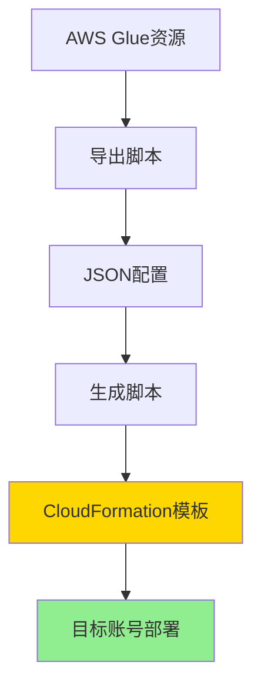
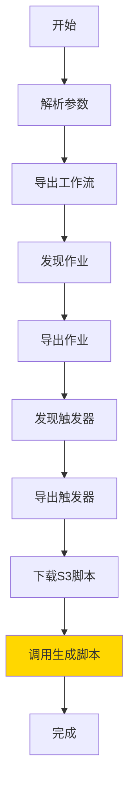
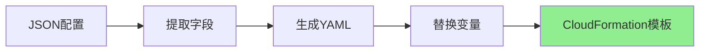
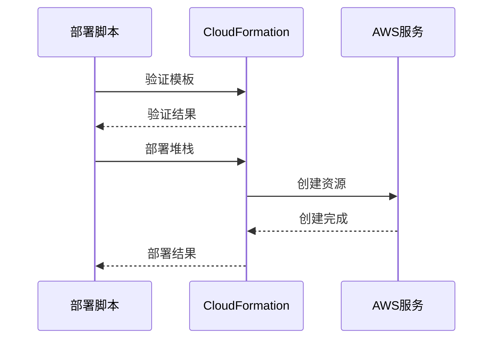
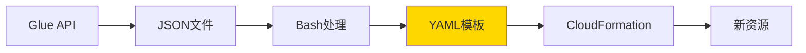
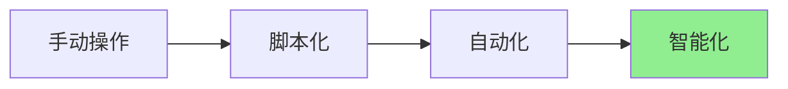

# 技术架构说明

## 🏗️ 整体架构



## 🔧 核心组件

### 1. 导出脚本 (export-glue-to-cloudformation.sh)

**功能**: 从AWS Glue服务导出资源配置



**关键技术**:
- AWS CLI API调用
- JMESPath查询过滤
- Bash脚本自动化

**核心命令**:
```bash
# 导出工作流
aws glue get-workflow --name <name>

# 智能发现作业
aws glue list-jobs | jq '.JobNames[] | select(contains("workflow"))'

# 下载S3脚本
aws s3 cp s3://bucket/script.py ./
```

### 2. 生成脚本 (generate-cloudformation-from-export.sh)

**功能**: 将JSON配置转换为CloudFormation模板



**数据提取**:
```bash
# 提取工作流名称
WORKFLOW_NAME=$(grep -o '"Name": "[^"]*"' workflow.json | cut -d'"' -f4)

# 提取IAM角色
JOB_ROLE=$(grep -o '"Role": "[^"]*"' job.json | cut -d'"' -f4)

# 提取S3路径
SCRIPT_LOCATION=$(grep -o 's3://[^"]*' job.json)
```

**模板生成**:
```bash
# 使用Here Document生成YAML
cat > template.yaml << 'EOF'
AWSTemplateFormatVersion: '2010-09-09'
Resources:
  GlueWorkflow:
    Type: AWS::Glue::Workflow
    Properties:
      Name: !Sub "${ProjectName}-${Environment}"
EOF

# 替换占位符
sed -i '' "s|PLACEHOLDER|$VALUE|g" template.yaml
```

### 3. 部署脚本 (deploy-glue-stack.sh)

**功能**: 验证和部署CloudFormation模板



## 📊 数据流转



### JSON → YAML 转换

**输入 (workflow.json)**:
```json
{
  "Workflow": {
    "Name": "helloworld",
    "Description": "Simple demo workflow"
  }
}
```

**输出 (generated-cloudformation.yaml)**:
```yaml
Resources:
  GlueWorkflow:
    Type: AWS::Glue::Workflow
    Properties:
      Name: !Sub "${ProjectName}-${Environment}"
      Description: Simple demo workflow
```

## 🔍 关键技术点

### 1. JMESPath 查询

**用途**: 从JSON中智能提取数据

```bash
# 过滤包含特定字符串的作业
aws glue list-jobs \
  --query "JobNames[?contains(@, 'helloworld')]" \
  --output text
```

**语法**:
- `JobNames[?...]`: 过滤数组
- `contains(@, 'xxx')`: 包含检查
- `@`: 当前元素引用

### 2. Bash 参数展开

```bash
# 默认值
WORKFLOW_NAME=${1:-helloworld}

# 命令替换
JOB_NAME=$(aws glue list-jobs ...)

# 条件赋值
[ -z "$VAR" ] && VAR="default"
```

### 3. Here Document

```bash
cat > file.yaml << 'EOF'
多行内容
支持变量: $VAR
EOF
```

### 4. sed 文本替换

```bash
# 全局替换
sed -i '' "s|old|new|g" file.yaml

# 使用不同分隔符避免转义
sed -i '' "s|s3://bucket|s3://new-bucket|g" file.yaml
```

## 🎯 设计原则

### 1. 自动化优先



- 减少人工干预
- 提高准确性
- 降低错误率

### 2. AWS 原生工具

- 使用 AWS CLI
- 遵循 AWS 最佳实践
- 无第三方依赖

### 3. 可扩展性

```bash
# 易于添加新资源类型
export_crawler() {
    aws glue get-crawler --name $1 > crawler.json
}

# 易于自定义模板
customize_template() {
    # 添加自定义资源
}
```

## 📈 性能优化

### 1. 并行处理

```bash
# 并行导出多个资源
export_workflow &
export_job &
export_trigger &
wait
```

### 2. 缓存机制

```bash
# 避免重复API调用
if [ ! -f "workflow.json" ]; then
    aws glue get-workflow --name $NAME > workflow.json
fi
```

### 3. 错误处理

```bash
# 快速失败
set -e

# 条件检查
if [ $? -ne 0 ]; then
    echo "错误: 导出失败"
    exit 1
fi
```

## 🔒 安全考虑

### 1. 凭证管理

- 使用 AWS CLI 配置文件
- 支持 IAM 角色
- 避免硬编码凭证

### 2. 权限最小化

```json
{
  "Version": "2012-10-17",
  "Statement": [{
    "Effect": "Allow",
    "Action": [
      "glue:GetWorkflow",
      "glue:GetJob",
      "glue:GetTrigger",
      "s3:GetObject"
    ],
    "Resource": "*"
  }]
}
```

### 3. 数据保护

- 敏感信息脱敏
- 加密传输
- 访问控制

## 🧪 测试策略

### 1. 单元测试

```bash
# 测试导出功能
test_export() {
    ./export-glue-to-cloudformation.sh test-workflow
    [ -f "cloudformation-export/workflow.json" ]
}
```

### 2. 集成测试

```bash
# 端到端测试
test_e2e() {
    # 导出
    ./export-glue-to-cloudformation.sh test-workflow
    
    # 验证
    aws cloudformation validate-template \
      --template-body file://cloudformation-export/generated-cloudformation.yaml
    
    # 部署
    aws cloudformation deploy --template-file ...
}
```

## 📊 监控指标

- 导出成功率
- 模板生成时间
- 部署成功率
- 资源创建时间

## 🔄 持续改进

### 未来增强

1. **支持更多资源类型**
   - Crawler
   - Connection
   - Database

2. **增强模板功能**
   - 自动生成IAM角色
   - 包含S3存储桶
   - Lambda脚本上传

3. **改进用户体验**
   - 交互式配置
   - 进度显示
   - 详细日志

---

**相关文档**: [使用指南](GUIDE.md) | [Prompt记录](PROMPTS.md)
