# AWS Glue CloudFormation 自动生成方法完整指南

> 全面介绍 AWS Glue 工作流 CloudFormation 模板自动生成的方法、流程和最佳实践

## 📋 目录

- [方案概述](#方案概述)
- [智能自动生成流程](#智能自动生成流程)
- [三种复杂度级别](#三种复杂度级别)
- [五种打包方法对比](#五种打包方法对比)
- [自动化工具使用](#自动化工具使用)
- [部署流程详解](#部署流程详解)
- [最佳实践](#最佳实践)
- [常见问题](#常见问题)

---

## 方案概述

### 核心价值

本方案提供完全自动化的 CloudFormation 模板生成能力，实现：

- ✅ **零手写代码**: 无需手动编写任何 CloudFormation YAML/JSON
- ✅ **智能复杂度检测**: 自动识别项目规模并选择最佳生成方法
- ✅ **多种打包方法**: 支持 5 种 AWS 原生打包方法
- ✅ **标准化输出**: 统一输出到 \`cloudformation-export/\` 目录
- ✅ **即用模板**: 生成的模板可直接部署，无需修改


### 整体架构

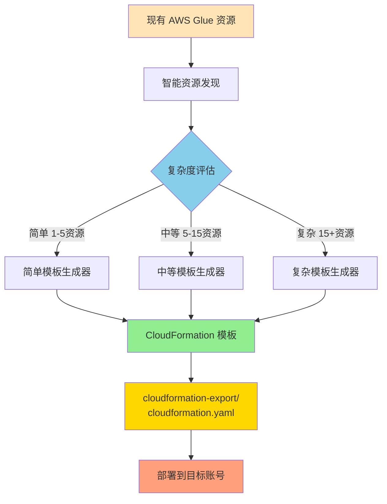

---

## 智能自动生成流程

### 端到端工作流

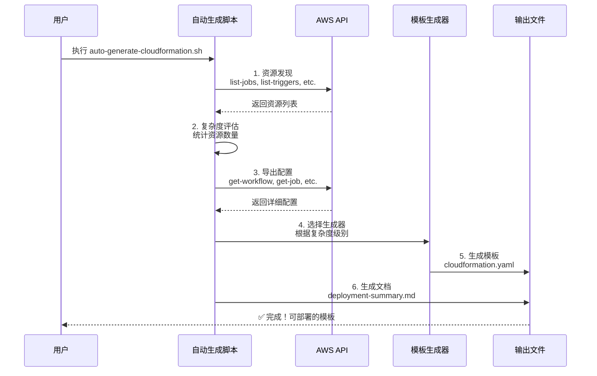

### 五个关键步骤

#### 步骤 1: 智能资源发现

自动扫描并识别与工作流相关的所有 Glue 资源：

```bash
# 发现工作流
aws glue get-workflow --name <workflow-name>

# 发现相关作业
aws glue list-jobs --query "JobNames[?contains(@, '<workflow-name>')]"

# 发现触发器
aws glue list-triggers --query "TriggerNames[?contains(@, '<workflow-name>')]"

# 发现爬虫（可选）
aws glue list-crawlers --query "CrawlerNames[?contains(@, '<workflow-name>')]"
```

**输出示例**:
```
✅ 找到工作流: my-etl-workflow
✅ 找到 3 个作业
✅ 找到 3 个触发器
✅ 找到 1 个爬虫
━━━━━━━━━━━━━━━━━━━━━━━━━━━
📊 资源统计:
   总资源数: 8
   - 工作流: 1
   - 作业: 3
   - 触发器: 3
   - 爬虫: 1
```


#### 步骤 2: 项目复杂度评估

根据资源数量自动评估项目复杂度：

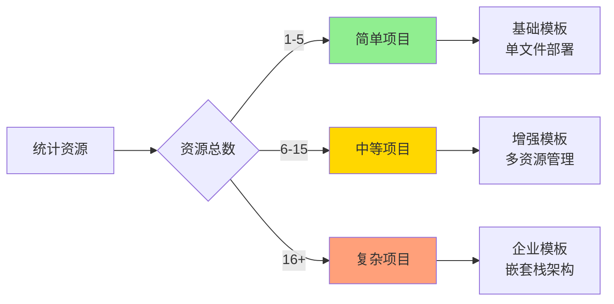

**评估标准**:

| 复杂度级别 | 资源数量 | 推荐方法 | 特点 |
|-----------|---------|---------|------|
| 🟢 简单 | 1-5 | 方法一: CLI + Bash | 快速、轻量、易维护 |
| 🟡 中等 | 6-15 | 方法一增强版 | 参数化、多环境支持 |
| 🔴 复杂 | 16+ | 方法一高级版 或 方法四: CDK | 嵌套栈、完整监控 |

#### 步骤 3: 导出资源配置

将所有资源的配置导出为 JSON 文件：

```bash
cloudformation-export/
├── workflow.json          # 工作流配置
├── job-1.json            # 作业 1 配置
├── job-2.json            # 作业 2 配置  
├── job-3.json            # 作业 3 配置
├── trigger-1.json        # 触发器 1 配置
├── trigger-2.json        # 触发器 2 配置
├── trigger-3.json        # 触发器 3 配置
├── crawler-1.json        # 爬虫配置
└── scripts/              # Glue 脚本文件
    ├── job1.py
    ├── job2.py
    └── job3.py
```

#### 步骤 4: 生成 CloudFormation 模板

根据复杂度级别，选择对应的生成器：

```bash
# 简单项目
./scripts/generate-simple-cloudformation.sh

# 中等项目
./scripts/generate-medium-cloudformation.sh

# 复杂项目
./scripts/generate-complex-cloudformation.sh
```

**生成的模板结构**:

```yaml
AWSTemplateFormatVersion: '2010-09-09'
Description: 'AWS Glue 工作流 - 自动生成'

Parameters:         # 可配置参数
  Environment: ...
  ProjectName: ...

Resources:          # AWS 资源定义
  GlueWorkflow: ...
  GlueJob1: ...
  GlueJob2: ...
  GlueTrigger1: ...

Outputs:            # 堆栈输出
  WorkflowName: ...
  JobNames: ...
```

#### 步骤 5: 生成文档和摘要

自动生成部署文档和资源摘要：

1. **deployment-summary.md**: 详细的部署说明（Markdown 格式）
2. **resource-summary.txt**: 简要的资源摘要（文本格式）

---


## 三种复杂度级别

### 1. 简单项目（1-5 个资源）

#### 特点

- 单工作流 + 1-2 个作业 + 简单触发器
- 基础配置，快速部署
- 适合学习和测试

#### 模板特性

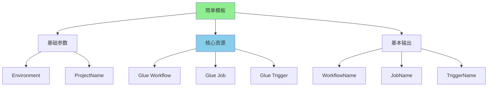

#### 生成命令

```bash
./scripts/auto-generate-cloudformation.sh my-simple-workflow default us-east-1
```

#### 模板示例

```yaml
AWSTemplateFormatVersion: '2010-09-09'
Description: 'AWS Glue 工作流 - 简单项目'

Parameters:
  Environment:
    Type: String
    Default: dev
    AllowedValues: [dev, test, prod]
  
  ProjectName:
    Type: String
    Default: my-simple-workflow

Resources:
  GlueWorkflow:
    Type: AWS::Glue::Workflow
    Properties:
      Name: !Sub '${ProjectName}-${Environment}'
      Description: "简单 ETL 工作流"

  GlueJob:
    Type: AWS::Glue::Job
    Properties:
      Name: !Sub '${ProjectName}-job-${Environment}'
      Role: <IAM-ROLE-ARN>
      Command:
        Name: glueetl
        ScriptLocation: s3://bucket/script.py
      GlueVersion: "4.0"
      WorkerType: G.1X
      NumberOfWorkers: 2

  GlueTrigger:
    Type: AWS::Glue::Trigger
    Properties:
      Name: !Sub '${ProjectName}-trigger-${Environment}'
      Type: ON_DEMAND
      WorkflowName: !Ref GlueWorkflow
      Actions:
        - JobName: !Ref GlueJob
```

### 2. 中等项目（6-15 个资源）

#### 特点

- 多个作业组成的数据管道
- 复杂的触发器依赖
- 参数化配置
- 多环境支持

#### 模板特性

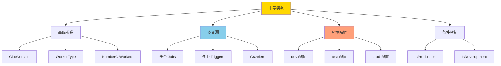


#### 模板增强

- **环境映射（Mappings）**: 不同环境的不同配置
- **条件资源（Conditions）**: 根据环境创建不同资源
- **参数化**: 更灵活的配置选项
- **循环支持**: 批量创建相似资源

```yaml
Mappings:
  EnvironmentConfig:
    dev:
      LogLevel: INFO
      MaxRetries: 0
      Timeout: 2880
    prod:
      LogLevel: WARN
      MaxRetries: 2
      Timeout: 4320

Conditions:
  IsProduction: !Equals [!Ref Environment, prod]

Resources:
  GlueJob1:
    Type: AWS::Glue::Job
    Properties:
      MaxRetries: !FindInMap [EnvironmentConfig, !Ref Environment, MaxRetries]
      NumberOfWorkers: !If [IsProduction, 10, 2]
```

### 3. 复杂项目（16+ 个资源）

#### 特点

- 企业级数据管道
- 完整的 IAM 角色管理
- S3 存储桶配置
- 监控和告警
- 安全配置
- 可能使用嵌套栈

#### 架构设计

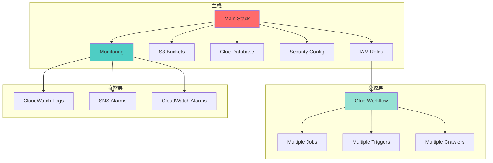

#### 关键特性

1. **完整的 IAM 角色定义**

```yaml
GlueServiceRole:
  Type: AWS::IAM::Role
  Properties:
    RoleName: !Sub '${ProjectName}-glue-role-${Environment}'
    AssumeRolePolicyDocument:
      Version: '2012-10-17'
      Statement:
        - Effect: Allow
          Principal:
            Service: glue.amazonaws.com
          Action: 'sts:AssumeRole'
    ManagedPolicyArns:
      - 'arn:aws:iam::aws:policy/service-role/AWSGlueServiceRole'
    Policies:
      - PolicyName: GlueS3Access
        PolicyDocument: ...
```

2. **S3 存储桶配置**

```yaml
ScriptBucket:
  Type: AWS::S3::Bucket
  Properties:
    BucketName: !Sub '${ProjectName}-glue-scripts-${Environment}-${AWS::AccountId}'
    VersioningConfiguration:
      Status: Enabled
    PublicAccessBlockConfiguration:
      BlockPublicAcls: true
      BlockPublicPolicy: true
    BucketEncryption:
      ServerSideEncryptionConfiguration:
        - ServerSideEncryptionByDefault:
            SSEAlgorithm: AES256
```

3. **监控和告警**

```yaml
JobFailureAlarm:
  Type: AWS::CloudWatch::Alarm
  Properties:
    AlarmName: !Sub '${ProjectName}-job-failures-${Environment}'
    MetricName: glue.driver.aggregate.numFailedTasks
    Namespace: Glue
    Threshold: 1
    AlarmActions:
      - !Ref AlarmTopic
```

4. **安全配置**

```yaml
GlueSecurityConfiguration:
  Type: AWS::Glue::SecurityConfiguration
  Condition: IsProduction
  Properties:
    Name: !Sub '${ProjectName}-security-config'
    EncryptionConfiguration:
      S3Encryptions:
        - S3EncryptionMode: SSE-S3
      CloudWatchEncryption:
        CloudWatchEncryptionMode: DISABLED
```

---


## 五种打包方法对比

### 方法概览

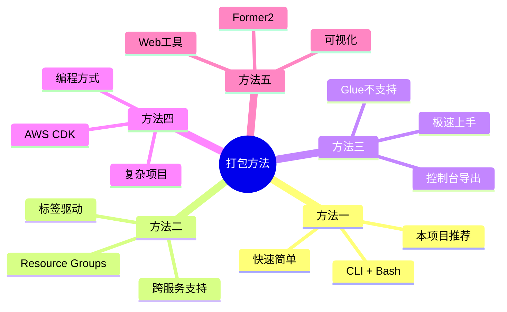

### 详细对比表

| 特性 | 方法一<br/>CLI + Bash | 方法二<br/>Resource Groups | 方法三<br/>控制台 | 方法四<br/>CDK | 方法五<br/>Former2 |
|------|---------------------|------------------------|----------------|---------------|------------------|
| **自动化程度** | ⭐⭐⭐⭐⭐ | ⭐⭐⭐⭐ | ⭐⭐ | ⭐⭐⭐⭐ | ⭐⭐⭐ |
| **Glue 支持** | ✅ 完美 | ✅ 良好 | ❌ 不支持 | ✅ 完美 | ✅ 良好 |
| **学习成本** | 🟡 中等 | 🟡 中等 | 🟢 低 | 🔴 高 | 🟢 低 |
| **适用复杂度** | 简单-复杂 | 中等-复杂 | 简单 | 中等-复杂 | 任意 |
| **速度** | 2-5分钟 | 5-10分钟 | 1分钟 | 30-60分钟 | 2-3分钟 |
| **CI/CD 集成** | ✅ 优秀 | ✅ 良好 | ❌ 不适用 | ✅ 优秀 | ❌ 不适用 |
| **维护成本** | 🟡 中等 | 🟡 中等 | 🟢 低 | 🔴 高 | 🟢 低 |
| **AWS 官方** | ✅ 是 | ✅ 是 | ✅ 是 | ✅ 是 | ❌ 否 |
| **本项目实现** | ✅ 完整 | ⚠️ 指南 | ⚠️ 指南 | ⚠️ 指南 | ⚠️ 指南 |

### 方法一: CLI + Bash（推荐✨）

**本项目完整实现的方法**

#### 优势

- ✅ 完全自动化，零手写代码
- ✅ 支持所有 Glue 资源类型
- ✅ 智能复杂度检测
- ✅ 易于集成 CI/CD
- ✅ 快速执行（2-5分钟）

#### 工作流

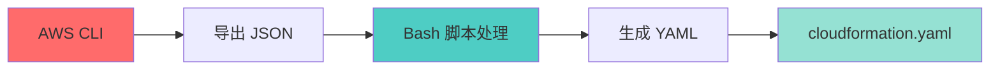

#### 使用示例

```bash
# 一键生成
./scripts/auto-generate-cloudformation.sh my-workflow default us-east-1

# 输出
✅ CloudFormation 模板已生成
📁 cloudformation-export/cloudformation.yaml
```

### 方法二: Resource Groups

**基于标签的资源管理和导出**

#### 适用场景

- 已有完善的标签策略
- 需要跨服务资源导出
- 团队协作项目

#### 工作流

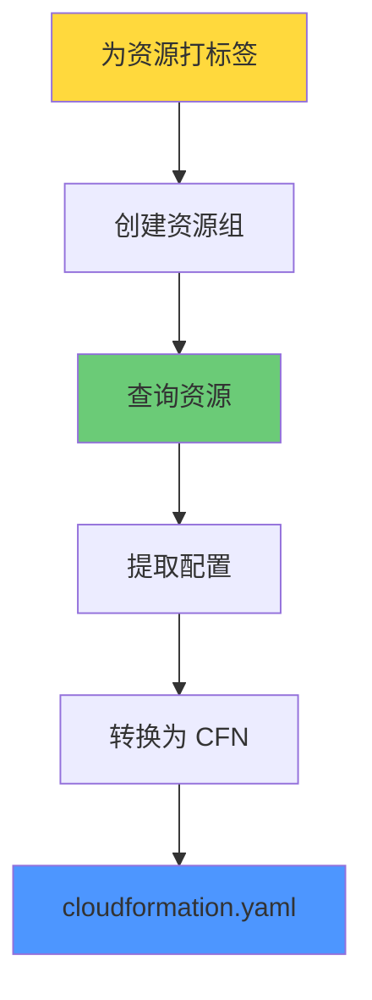

#### 示例步骤

```bash
# 1. 为资源打标签
aws glue tag-resource \
  --resource-arn <workflow-arn> \
  --tags-to-add "Project=my-project,Environment=dev"

# 2. 创建资源组
aws resource-groups create-group \
  --name my-project-resources \
  --resource-query '...'

# 3. 导出资源
aws resource-groups list-group-resources \
  --group-name my-project-resources
```

### 方法三: AWS 控制台导出

**图形界面一键导出（Glue 不支持）**

#### 支持的服务

- ✅ Lambda 函数
- ✅ DynamoDB 表
- ✅ API Gateway
- ❌ AWS Glue（不支持）

### 方法四: AWS CDK

**编程方式定义基础设施**

#### 适用场景

- 复杂的企业级项目
- 需要编程逻辑
- 长期维护项目

#### Python 示例

```python
from aws_cdk import (
    Stack,
    aws_glue as glue,
)

class GlueStack(Stack):
    def __init__(self, scope, id, **kwargs):
        super().__init__(scope, id, **kwargs)
        
        workflow = glue.CfnWorkflow(
            self, "Workflow",
            name="my-workflow"
        )
        
        job = glue.CfnJob(
            self, "Job",
            name="my-job",
            role=role_arn,
            command=glue.CfnJob.JobCommandProperty(
                name="glueetl",
                script_location="s3://bucket/script.py"
            )
        )
```

```bash
# 生成 CloudFormation
cdk synth > cloudformation-export/cloudformation.yaml
```

### 方法五: Former2

**Web 工具可视化导出**

#### 使用步骤

1. 访问 https://former2.com
2. 配置 AWS 凭证
3. 扫描账号资源
4. 选择要导出的资源
5. 生成 CloudFormation

#### 注意事项

⚠️ 需要在浏览器中输入 AWS 凭证，建议使用临时凭证

---


## 自动化工具使用

### 主工具: auto-generate-cloudformation.sh

**智能自动生成 CloudFormation 模板的核心工具**

#### 使用方法

```bash
./scripts/auto-generate-cloudformation.sh [工作流名称] [AWS配置文件] [区域]
```

#### 参数说明

| 参数 | 必需 | 默认值 | 说明 |
|------|------|--------|------|
| 工作流名称 | 否 | helloworld | 要导出的 Glue 工作流名称 |
| AWS配置文件 | 否 | default | AWS CLI 配置文件 |
| 区域 | 否 | us-east-1 | AWS 区域 |

#### 执行示例

```bash
# 示例 1: 使用默认参数
./scripts/auto-generate-cloudformation.sh

# 示例 2: 指定工作流名称
./scripts/auto-generate-cloudformation.sh my-etl-workflow

# 示例 3: 完整参数
./scripts/auto-generate-cloudformation.sh my-workflow oversea1 us-west-2
```

#### 执行输出

```
╔═══════════════════════════════════════════════════════════╗
║  AWS Glue CloudFormation 自动生成工具                    ║
║  智能检测 • 自动生成 • 零代码配置                        ║
╚═══════════════════════════════════════════════════════════╝

📋 配置参数:
   工作流名称: my-workflow
   AWS配置文件: default
   区域: us-east-1
   输出目录: ./cloudformation-export

━━━━━━━━━━━━━━━━━━━━━━━━━━━━━━━━━━━━━━━━━━━━━━━━━━━━━━
🔍 步骤 1/5: 智能资源发现
━━━━━━━━━━━━━━━━━━━━━━━━━━━━━━━━━━━━━━━━━━━━━━━━━━━━━━
   ✅ 找到工作流: my-workflow
   ✅ 找到 3 个作业
   ✅ 找到 3 个触发器
   ⚠️  未找到爬虫（可选资源）

   📊 资源统计:
      总资源数: 7
      - 工作流: 1
      - 作业: 3
      - 触发器: 3
      - 爬虫: 0

━━━━━━━━━━━━━━━━━━━━━━━━━━━━━━━━━━━━━━━━━━━━━━━━━━━━━━
🎯 步骤 2/5: 项目复杂度评估
━━━━━━━━━━━━━━━━━━━━━━━━━━━━━━━━━━━━━━━━━━━━━━━━━━━━━━
   复杂度级别: 中等
   推荐方法: 方法一: CLI + Bash 脚本（增强版）

━━━━━━━━━━━━━━━━━━━━━━━━━━━━━━━━━━━━━━━━━━━━━━━━━━━━━━
📦 步骤 3/5: 导出资源配置
━━━━━━━━━━━━━━━━━━━━━━━━━━━━━━━━━━━━━━━━━━━━━━━━━━━━━━
   ✅ 工作流配置已保存
   ✅ 作业 1: my-workflow-extract-job
   ✅ 作业 2: my-workflow-transform-job
   ✅ 作业 3: my-workflow-load-job
   ✅ 触发器 1: my-workflow-trigger-1
   ✅ 触发器 2: my-workflow-trigger-2
   ✅ 触发器 3: my-workflow-trigger-3
   ✅ 脚本已下载: extract_job.py

━━━━━━━━━━━━━━━━━━━━━━━━━━━━━━━━━━━━━━━━━━━━━━━━━━━━━━
🔨 步骤 4/5: 生成 CloudFormation 模板
━━━━━━━━━━━━━━━━━━━━━━━━━━━━━━━━━━━━━━━━━━━━━━━━━━━━━━
   使用中等复杂度模板生成器...
   ✅ CloudFormation 模板已生成

━━━━━━━━━━━━━━━━━━━━━━━━━━━━━━━━━━━━━━━━━━━━━━━━━━━━━━
📝 步骤 5/5: 生成文档和摘要
━━━━━━━━━━━━━━━━━━━━━━━━━━━━━━━━━━━━━━━━━━━━━━━━━━━━━━
   ✅ 部署摘要已生成: deployment-summary.md
   ✅ 资源摘要已生成: resource-summary.txt

╔═══════════════════════════════════════════════════════════╗
║  ✅ CloudFormation 模板生成完成！                        ║
╚═══════════════════════════════════════════════════════════╝

📊 生成统计:
   • 复杂度级别: 中等
   • 资源总数: 7
   • 输出目录: ./cloudformation-export

📁 生成的文件:
   • cloudformation.yaml        - CloudFormation 模板
   • deployment-summary.md      - 部署说明文档
   • resource-summary.txt       - 资源摘要
   • workflow.json              - 工作流配置
   • job-*.json                 - 作业配置
   • trigger-*.json             - 触发器配置

🚀 快速部署:

   # 1. 验证模板
   aws cloudformation validate-template \
     --template-body file://./cloudformation-export/cloudformation.yaml

   # 2. 部署到目标账号
   aws cloudformation deploy \
     --template-file ./cloudformation-export/cloudformation.yaml \
     --stack-name my-workflow-stack \
     --capabilities CAPABILITY_IAM \
     --parameter-overrides Environment=dev ProjectName=my-workflow
```

### 复杂度专用生成器

#### 简单项目生成器

```bash
./scripts/generate-simple-cloudformation.sh [导出目录] [项目名称]
```

**适用于**: 1-5 个资源的简单工作流

**特性**:
- 基础参数配置
- 核心资源定义
- 简单输出

#### 中等项目生成器

```bash
./scripts/generate-medium-cloudformation.sh [导出目录] [项目名称]
```

**适用于**: 6-15 个资源的数据管道

**特性**:
- 环境映射（Mappings）
- 条件控制（Conditions）
- 多作业支持
- 参数化配置

#### 复杂项目生成器

```bash
./scripts/generate-complex-cloudformation.sh [导出目录] [项目名称]
```

**适用于**: 16+ 个资源的企业级项目

**特性**:
- 完整 IAM 角色
- S3 存储桶管理
- 监控和告警
- 安全配置
- 可能使用嵌套栈

---


## 部署流程详解

### 完整部署流程

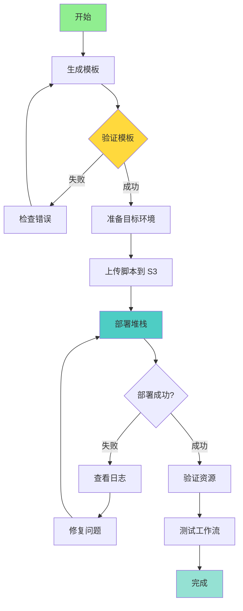

### 步骤 1: 生成模板

```bash
# 执行自动生成脚本
./scripts/auto-generate-cloudformation.sh my-workflow default us-east-1

# 查看生成的模板
cat cloudformation-export/cloudformation.yaml

# 查看部署说明
cat cloudformation-export/deployment-summary.md
```

### 步骤 2: 验证模板

```bash
# 使用 AWS CLI 验证
aws cloudformation validate-template \
  --template-body file://cloudformation-export/cloudformation.yaml

# 成功输出示例
{
    "Parameters": [
        {
            "ParameterKey": "Environment",
            "DefaultValue": "dev",
            "NoEcho": false,
            "Description": "部署环境"
        },
        {
            "ParameterKey": "ProjectName",
            "DefaultValue": "my-workflow",
            "NoEcho": false,
            "Description": "项目名称"
        }
    ],
    "Description": "AWS Glue 工作流 - 自动生成"
}
```

**可选: 使用 cfn-lint 进行高级验证**

```bash
# 安装 cfn-lint
pip install cfn-lint

# 验证模板
cfn-lint cloudformation-export/cloudformation.yaml

# 检查特定规则
cfn-lint cloudformation-export/cloudformation.yaml \
  --regions us-east-1 \
  --ignore-checks W
```

### 步骤 3: 准备目标环境

#### 3.1 创建 IAM 角色（如果不存在）

```bash
# 创建 Glue 服务角色
aws iam create-role \
  --role-name MyGlueServiceRole \
  --assume-role-policy-document '{
    "Version": "2012-10-17",
    "Statement": [{
      "Effect": "Allow",
      "Principal": {"Service": "glue.amazonaws.com"},
      "Action": "sts:AssumeRole"
    }]
  }'

# 附加托管策略
aws iam attach-role-policy \
  --role-name MyGlueServiceRole \
  --policy-arn arn:aws:iam::aws:policy/service-role/AWSGlueServiceRole
```

#### 3.2 创建 S3 存储桶

```bash
# 创建脚本存储桶
aws s3 mb s3://my-workflow-scripts-dev-${ACCOUNT_ID} --region us-east-1

# 启用版本控制
aws s3api put-bucket-versioning \
  --bucket my-workflow-scripts-dev-${ACCOUNT_ID} \
  --versioning-configuration Status=Enabled
```

#### 3.3 上传 Glue 脚本

```bash
# 上传所有脚本
aws s3 sync cloudformation-export/scripts/ \
  s3://my-workflow-scripts-dev-${ACCOUNT_ID}/scripts/ \
  --region us-east-1

# 验证上传
aws s3 ls s3://my-workflow-scripts-dev-${ACCOUNT_ID}/scripts/
```

### 步骤 4: 部署 CloudFormation 堆栈

#### 方法 1: 使用 aws cloudformation deploy（推荐）

```bash
aws cloudformation deploy \
  --template-file cloudformation-export/cloudformation.yaml \
  --stack-name my-workflow-dev-stack \
  --capabilities CAPABILITY_IAM CAPABILITY_NAMED_IAM \
  --parameter-overrides \
      Environment=dev \
      ProjectName=my-workflow \
  --tags \
      Environment=dev \
      Project=my-workflow \
      ManagedBy=CloudFormation \
  --profile target-account \
  --region us-east-1
```

**参数说明**:

| 参数 | 说明 |
|------|------|
| `--template-file` | CloudFormation 模板文件路径 |
| `--stack-name` | 堆栈名称（唯一标识） |
| `--capabilities` | 授权创建 IAM 资源 |
| `--parameter-overrides` | 参数覆盖 |
| `--tags` | 堆栈标签 |
| `--profile` | AWS CLI 配置文件 |
| `--region` | 部署区域 |

#### 方法 2: 使用 aws cloudformation create-stack

```bash
aws cloudformation create-stack \
  --stack-name my-workflow-dev-stack \
  --template-body file://cloudformation-export/cloudformation.yaml \
  --parameters \
      ParameterKey=Environment,ParameterValue=dev \
      ParameterKey=ProjectName,ParameterValue=my-workflow \
  --capabilities CAPABILITY_IAM \
  --tags \
      Key=Environment,Value=dev \
      Key=Project,Value=my-workflow \
  --profile target-account \
  --region us-east-1
```

#### 方法 3: 使用参数文件

```bash
# 创建参数文件
cat > parameters.json << EOF
[
  {
    "ParameterKey": "Environment",
    "ParameterValue": "dev"
  },
  {
    "ParameterKey": "ProjectName",
    "ParameterValue": "my-workflow"
  }
]
EOF

# 使用参数文件部署
aws cloudformation deploy \
  --template-file cloudformation-export/cloudformation.yaml \
  --stack-name my-workflow-dev-stack \
  --parameter-overrides file://parameters.json \
  --capabilities CAPABILITY_IAM
```

### 步骤 5: 监控部署进度

```bash
# 查看堆栈状态
aws cloudformation describe-stacks \
  --stack-name my-workflow-dev-stack \
  --query 'Stacks[0].StackStatus' \
  --output text

# 监控堆栈事件
aws cloudformation describe-stack-events \
  --stack-name my-workflow-dev-stack \
  --max-items 20

# 实时监控（每 10 秒刷新）
watch -n 10 aws cloudformation describe-stacks \
  --stack-name my-workflow-dev-stack \
  --query 'Stacks[0].[StackStatus,LastUpdatedTime]' \
  --output table
```

**部署状态说明**:

| 状态 | 说明 |
|------|------|
| `CREATE_IN_PROGRESS` | 正在创建 |
| `CREATE_COMPLETE` | 创建成功 ✅ |
| `CREATE_FAILED` | 创建失败 ❌ |
| `ROLLBACK_IN_PROGRESS` | 正在回滚 |
| `ROLLBACK_COMPLETE` | 回滚完成 |
| `UPDATE_IN_PROGRESS` | 正在更新 |
| `UPDATE_COMPLETE` | 更新成功 ✅ |

### 步骤 6: 验证部署

```bash
# 查看堆栈输出
aws cloudformation describe-stacks \
  --stack-name my-workflow-dev-stack \
  --query 'Stacks[0].Outputs' \
  --output table

# 验证 Glue 工作流
aws glue get-workflow \
  --name my-workflow-dev

# 查看作业列表
aws glue list-jobs \
  --query "JobNames[?contains(@, 'my-workflow-dev')]"

# 查看触发器列表
aws glue list-triggers \
  --query "TriggerNames[?contains(@, 'my-workflow-dev')]"
```

### 步骤 7: 测试工作流

```bash
# 启动工作流
aws glue start-workflow-run \
  --name my-workflow-dev

# 获取运行 ID
RUN_ID=$(aws glue list-workflow-runs \
  --name my-workflow-dev \
  --query 'Runs[0].WorkflowRunId' \
  --output text)

# 查看运行状态
aws glue get-workflow-run \
  --name my-workflow-dev \
  --run-id $RUN_ID \
  --query 'Run.[Status,Statistics]' \
  --output table

# 查看作业运行详情
aws glue get-job-runs \
  --job-name my-workflow-job-dev \
  --max-results 5
```

### 步骤 8: 多环境部署

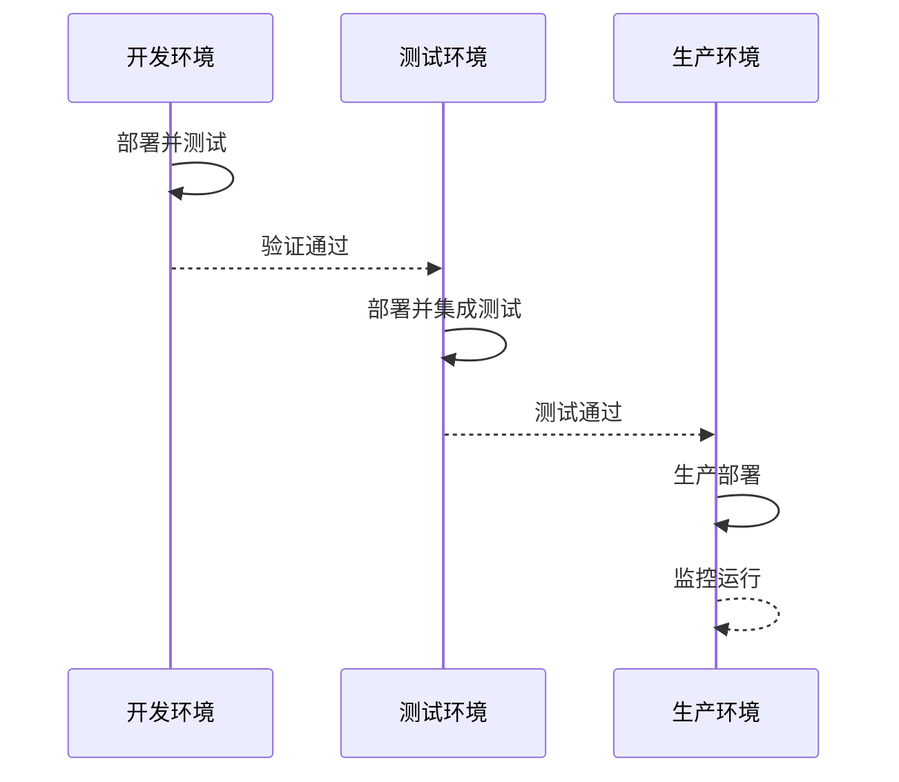

#### 开发环境

```bash
aws cloudformation deploy \
  --template-file cloudformation-export/cloudformation.yaml \
  --stack-name my-workflow-dev-stack \
  --parameter-overrides Environment=dev ProjectName=my-workflow \
  --capabilities CAPABILITY_IAM
```

#### 测试环境

```bash
aws cloudformation deploy \
  --template-file cloudformation-export/cloudformation.yaml \
  --stack-name my-workflow-test-stack \
  --parameter-overrides Environment=test ProjectName=my-workflow \
  --capabilities CAPABILITY_IAM \
  --profile test-account
```

#### 生产环境

```bash
# 生产环境需要额外确认
aws cloudformation deploy \
  --template-file cloudformation-export/cloudformation.yaml \
  --stack-name my-workflow-prod-stack \
  --parameter-overrides Environment=prod ProjectName=my-workflow \
  --capabilities CAPABILITY_IAM \
  --profile prod-account \
  --no-execute-changeset  # 先生成变更集，不立即执行

# 查看变更集
aws cloudformation describe-change-set \
  --stack-name my-workflow-prod-stack \
  --change-set-name <changeset-name>

# 确认后执行
aws cloudformation execute-change-set \
  --stack-name my-workflow-prod-stack \
  --change-set-name <changeset-name>
```

---


## 最佳实践

### 1. 资源命名规范

```yaml
# 推荐的命名模式
Name: !Sub '${ProjectName}-${ResourceType}-${Environment}'

# 示例
WorkflowName: my-etl-workflow-dev
JobName: my-etl-job-extract-dev
TriggerName: my-etl-trigger-start-dev
```

**命名原则**:
- 使用连字符 `-` 而不是下划线 `_`
- 包含项目名称、资源类型、环境
- 保持简短但有描述性
- 避免特殊字符

### 2. 参数化配置

#### 必备参数

```yaml
Parameters:
  Environment:
    Type: String
    AllowedValues: [dev, test, prod]
  
  ProjectName:
    Type: String
    AllowedPattern: '^[a-z][a-z0-9-]*$'
```

#### 可选参数

```yaml
Parameters:
  GlueVersion:
    Type: String
    Default: "4.0"
    
  WorkerType:
    Type: String
    Default: G.1X
    
  NumberOfWorkers:
    Type: Number
    Default: 2
    MinValue: 2
    MaxValue: 100
```

### 3. 使用环境映射

```yaml
Mappings:
  EnvironmentConfig:
    dev:
      LogLevel: DEBUG
      MaxRetries: 0
      Timeout: 2880
      EnableMetrics: "false"
    test:
      LogLevel: INFO
      MaxRetries: 1
      Timeout: 2880
      EnableMetrics: "true"
    prod:
      LogLevel: WARN
      MaxRetries: 2
      Timeout: 4320
      EnableMetrics: "true"

Resources:
  GlueJob:
    Type: AWS::Glue::Job
    Properties:
      MaxRetries: !FindInMap [EnvironmentConfig, !Ref Environment, MaxRetries]
      Timeout: !FindInMap [EnvironmentConfig, !Ref Environment, Timeout]
```

### 4. 标签策略

```yaml
Tags:
  - Key: Environment
    Value: !Ref Environment
  - Key: Project
    Value: !Ref ProjectName
  - Key: ManagedBy
    Value: CloudFormation
  - Key: CostCenter
    Value: DataEngineering
  - Key: Owner
    Value: data-team
  - Key: CreatedDate
    Value: !Sub '${AWS::StackId}'
```

**标签用途**:
- 成本跟踪和分摊
- 资源分组和管理
- 自动化运维
- 合规审计

### 5. 输出和导出

```yaml
Outputs:
  WorkflowName:
    Description: Glue 工作流名称
    Value: !Ref GlueWorkflow
    Export:
      Name: !Sub '${AWS::StackName}-WorkflowName'
  
  WorkflowArn:
    Description: Glue 工作流 ARN
    Value: !Sub 'arn:aws:glue:${AWS::Region}:${AWS::AccountId}:workflow/${GlueWorkflow}'
    Export:
      Name: !Sub '${AWS::StackName}-WorkflowArn'
```

**导出用途**:
- 跨堆栈引用
- CI/CD 集成
- 自动化测试

### 6. 安全最佳实践

#### IAM 最小权限原则

```yaml
GlueServiceRole:
  Type: AWS::IAM::Role
  Properties:
    AssumeRolePolicyDocument:
      Version: '2012-10-17'
      Statement:
        - Effect: Allow
          Principal:
            Service: glue.amazonaws.com
          Action: 'sts:AssumeRole'
    Policies:
      - PolicyName: MinimalGlueAccess
        PolicyDocument:
          Version: '2012-10-17'
          Statement:
            - Effect: Allow
              Action:
                - 's3:GetObject'
                - 's3:PutObject'
              Resource:
                - !Sub 'arn:aws:s3:::${ProjectName}-*/*'
            - Effect: Allow
              Action:
                - 'logs:CreateLogGroup'
                - 'logs:CreateLogStream'
                - 'logs:PutLogEvents'
              Resource:
                - !Sub 'arn:aws:logs:${AWS::Region}:${AWS::AccountId}:log-group:/aws-glue/*'
```

#### S3 加密

```yaml
ScriptBucket:
  Type: AWS::S3::Bucket
  Properties:
    BucketEncryption:
      ServerSideEncryptionConfiguration:
        - ServerSideEncryptionByDefault:
            SSEAlgorithm: AES256
    PublicAccessBlockConfiguration:
      BlockPublicAcls: true
      BlockPublicPolicy: true
      IgnorePublicAcls: true
      RestrictPublicBuckets: true
```

### 7. 监控和告警

#### CloudWatch 日志

```yaml
WorkflowLogGroup:
  Type: AWS::Logs::LogGroup
  Properties:
    LogGroupName: !Sub '/aws-glue/workflows/${ProjectName}-${Environment}'
    RetentionInDays: !If [IsProduction, 30, 7]
```

#### CloudWatch 告警

```yaml
JobFailureAlarm:
  Type: AWS::CloudWatch::Alarm
  Properties:
    AlarmName: !Sub '${ProjectName}-job-failures-${Environment}'
    AlarmDescription: Glue 作业失败次数超过阈值
    MetricName: glue.driver.aggregate.numFailedTasks
    Namespace: Glue
    Statistic: Sum
    Period: 300
    EvaluationPeriods: 1
    Threshold: 1
    ComparisonOperator: GreaterThanThreshold
    AlarmActions:
      - !Ref AlarmSNSTopic
```

### 8. 版本控制

```bash
# 为模板添加版本控制
git add cloudformation-export/
git commit -m "feat: 添加 my-workflow CloudFormation 模板"
git tag -a v1.0.0 -m "Release v1.0.0"
git push origin main --tags
```

### 9. CI/CD 集成

#### GitLab CI 示例

```yaml
# .gitlab-ci.yml
stages:
  - generate
  - validate
  - deploy

generate:
  stage: generate
  script:
    - ./scripts/auto-generate-cloudformation.sh $WORKFLOW_NAME $AWS_PROFILE $AWS_REGION
  artifacts:
    paths:
      - cloudformation-export/

validate:
  stage: validate
  script:
    - aws cloudformation validate-template --template-body file://cloudformation-export/cloudformation.yaml
    - cfn-lint cloudformation-export/cloudformation.yaml

deploy-dev:
  stage: deploy
  environment: development
  script:
    - |
      aws cloudformation deploy \
        --template-file cloudformation-export/cloudformation.yaml \
        --stack-name ${WORKFLOW_NAME}-dev-stack \
        --parameter-overrides Environment=dev ProjectName=${WORKFLOW_NAME} \
        --capabilities CAPABILITY_IAM
  only:
    - develop

deploy-prod:
  stage: deploy
  environment: production
  when: manual
  script:
    - |
      aws cloudformation deploy \
        --template-file cloudformation-export/cloudformation.yaml \
        --stack-name ${WORKFLOW_NAME}-prod-stack \
        --parameter-overrides Environment=prod ProjectName=${WORKFLOW_NAME} \
        --capabilities CAPABILITY_IAM
  only:
    - main
```

### 10. 文档维护

每次生成模板后，确保更新以下文档：

```
cloudformation-export/
├── cloudformation.yaml          # CloudFormation 模板
├── deployment-summary.md        # 部署说明
├── resource-summary.txt         # 资源摘要
├── README.md                    # 项目说明
└── CHANGELOG.md                 # 变更日志
```

---

## 常见问题

### Q1: 生成的模板中 IAM 角色 ARN 是硬编码的怎么办？

**A**: 有三种解决方案：

1. **在目标账号创建相同角色**
```bash
# 提取角色名称
ROLE_ARN=$(cat cloudformation-export/job.json | grep -o '"Role": "[^"]*"' | cut -d'"' -f4)
ROLE_NAME=$(echo $ROLE_ARN | awk -F'/' '{print $NF}')

# 在目标账号创建
aws iam create-role \
  --role-name $ROLE_NAME \
  --assume-role-policy-document file://trust-policy.json
```

2. **修改模板使用参数**
```yaml
Parameters:
  GlueRoleArn:
    Type: String
    Description: Glue 服务角色 ARN

Resources:
  GlueJob:
    Type: AWS::Glue::Job
    Properties:
      Role: !Ref GlueRoleArn
```

3. **在模板中创建新角色**（推荐复杂项目）
```yaml
Resources:
  GlueServiceRole:
    Type: AWS::IAM::Role
    Properties:
      # ... 角色定义

  GlueJob:
    Type: AWS::Glue::Job
    Properties:
      Role: !GetAtt GlueServiceRole.Arn
```

### Q2: S3 脚本路径问题？

**A**: 脚本需要上传到目标账号的 S3：

```bash
# 1. 下载脚本
aws s3 cp s3://source-bucket/script.py ./cloudformation-export/

# 2. 上传到目标账号
aws s3 cp ./cloudformation-export/script.py \
  s3://target-bucket/scripts/ \
  --profile target-account

# 3. 更新模板中的路径
sed -i 's|s3://source-bucket|s3://target-bucket|g' \
  cloudformation-export/cloudformation.yaml
```

### Q3: 如何处理跨区域部署？

**A**: 注意以下几点：

```bash
# 1. S3 存储桶名称必须全局唯一
BucketName: !Sub '${ProjectName}-scripts-${Environment}-${AWS::AccountId}-${AWS::Region}'

# 2. 在目标区域创建资源
aws cloudformation deploy \
  --template-file cloudformation-export/cloudformation.yaml \
  --stack-name my-stack \
  --region ap-southeast-1  # 目标区域

# 3. 确保脚本也在目标区域的 S3
aws s3 cp scripts/ s3://bucket-ap-southeast-1/scripts/ \
  --recursive \
  --region ap-southeast-1
```

### Q4: 如何回滚部署？

**A**: CloudFormation 提供自动回滚：

```bash
# 1. 查看堆栈事件
aws cloudformation describe-stack-events \
  --stack-name my-stack

# 2. 删除失败的堆栈
aws cloudformation delete-stack \
  --stack-name my-stack

# 3. 或使用之前的模板版本重新部署
aws cloudformation update-stack \
  --stack-name my-stack \
  --template-body file://cloudformation-v1.0.0.yaml \
  --parameters file://parameters.json
```

### Q5: 大型项目模板超过 51KB 限制？

**A**: 使用以下方法：

1. **上传模板到 S3**
```bash
aws s3 cp cloudformation-export/cloudformation.yaml \
  s3://my-templates-bucket/cloudformation.yaml

aws cloudformation deploy \
  --template-url https://s3.amazonaws.com/my-templates-bucket/cloudformation.yaml \
  --stack-name my-stack
```

2. **使用嵌套栈**
```yaml
# master-stack.yaml
Resources:
  JobsStack:
    Type: AWS::CloudFormation::Stack
    Properties:
      TemplateURL: https://s3.amazonaws.com/bucket/jobs-stack.yaml
      Parameters:
        Environment: !Ref Environment
```

3. **拆分为多个堆栈**
```bash
# 部署基础设施栈
aws cloudformation deploy \
  --template-file infrastructure-stack.yaml \
  --stack-name my-infra-stack

# 部署工作流栈
aws cloudformation deploy \
  --template-file workflow-stack.yaml \
  --stack-name my-workflow-stack
```

### Q6: 如何更新现有堆栈？

**A**: 使用 CloudFormation 更新：

```bash
# 1. 修改模板或参数

# 2. 创建变更集（推荐）
aws cloudformation create-change-set \
  --stack-name my-stack \
  --change-set-name my-changes \
  --template-body file://cloudformation-export/cloudformation.yaml \
  --parameters file://parameters.json

# 3. 查看变更
aws cloudformation describe-change-set \
  --stack-name my-stack \
  --change-set-name my-changes

# 4. 执行变更
aws cloudformation execute-change-set \
  --stack-name my-stack \
  --change-set-name my-changes

# 或直接更新（不推荐生产环境）
aws cloudformation deploy \
  --template-file cloudformation-export/cloudformation.yaml \
  --stack-name my-stack
```

### Q7: 如何处理资源依赖关系？

**A**: CloudFormation 自动处理依赖：

```yaml
Resources:
  # S3 存储桶
  ScriptBucket:
    Type: AWS::S3::Bucket

  # IAM 角色
  GlueRole:
    Type: AWS::IAM::Role
    Properties:
      Policies:
        - PolicyDocument:
            Statement:
              - Resource: !GetAtt ScriptBucket.Arn  # 自动依赖

  # Glue 作业
  GlueJob:
    Type: AWS::Glue::Job
    DependsOn:  # 显式依赖
      - ScriptBucket
      - GlueRole
    Properties:
      Role: !GetAtt GlueRole.Arn
```

### Q8: 如何清理所有资源？

**A**: 删除 CloudFormation 堆栈：

```bash
# 1. 列出所有相关堆栈
aws cloudformation list-stacks \
  --query "StackSummaries[?contains(StackName, 'my-workflow')].StackName"

# 2. 删除堆栈
aws cloudformation delete-stack \
  --stack-name my-workflow-dev-stack

# 3. 等待删除完成
aws cloudformation wait stack-delete-complete \
  --stack-name my-workflow-dev-stack

# 4. 验证删除
aws cloudformation describe-stacks \
  --stack-name my-workflow-dev-stack
# 应返回错误: Stack does not exist
```

---

## 总结

### 核心优势

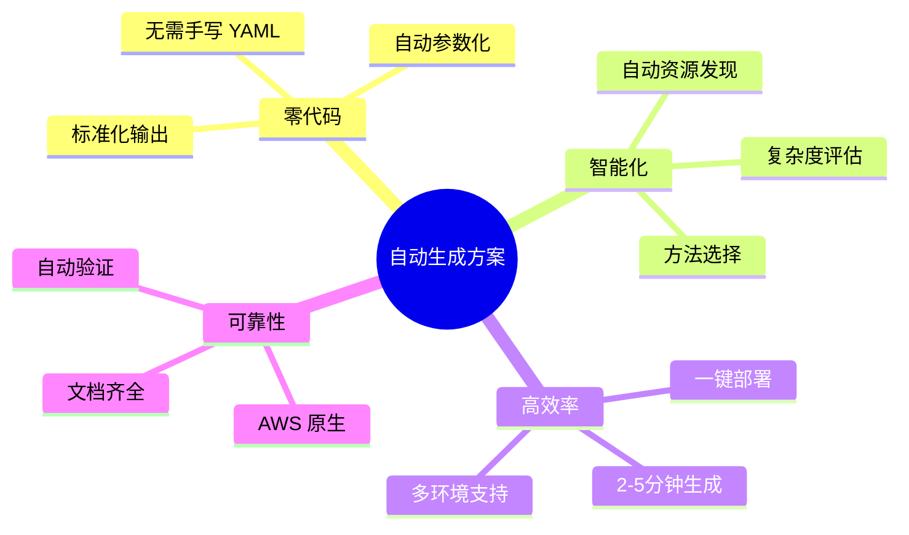

### 适用场景

| 场景 | 推荐方法 | 时间 | 复杂度 |
|------|---------|------|--------|
| 快速原型 | 方法一 | 2分钟 | 🟢 简单 |
| 开发测试 | 方法一 | 5分钟 | 🟡 中等 |
| 生产部署 | 方法一/四 | 10分钟 | 🔴 复杂 |
| 跨账号迁移 | 方法一 | 5分钟 | 🟡 中等 |
| 多区域部署 | 方法一 | 10分钟 | 🔴 复杂 |

### 下一步行动

1. **阅读文档**: 
   - [快速开始](../QUICKSTART.md)
   - [使用指南](GUIDE.md)
   - [架构说明](ARCHITECTURE.md)

2. **动手实践**:
   ```bash
   # 克隆项目
   git clone <repository-url>
   cd AWS-Glue-workflow-automation-deployment-solution
   
   # 运行示例
   ./scripts/auto-generate-cloudformation.sh helloworld default us-east-1
   ```

3. **加入社区**:
   - 提交 Issue
   - 贡献代码
   - 分享经验

---

**文档版本**: v1.0.0  
**最后更新**: 2025-12-18  
**维护者**: AWS Glue 自动化团队

EOF
echo "Documentation complete!"
