# AWS CloudFormation 打包方法综合指南

> 全面介绍将现有 AWS 项目打包为 CloudFormation 模板的 5 种原生方法

## 📋 目录

- [概述](#概述)
- [方法一：AWS CLI + Bash 自动化脚本（当前项目实现）](#方法一aws-cli--bash-自动化脚本当前项目实现)
- [方法二：AWS CloudFormer / Resource Groups](#方法二aws-cloudformer--resource-groups)
- [方法三：AWS 控制台一键导出](#方法三aws-控制台一键导出)
- [方法四：AWS CDK + cdk synth（复杂项目推荐）](#方法四aws-cdk--cdk-synth复杂项目推荐)
- [方法五：Former2 Web 工具](#方法五former2-web-工具)
- [方法对比矩阵](#方法对比矩阵)
- [决策树](#决策树)
- [Glue 项目实施建议](#glue-项目实施建议)
- [标准输出结构](#标准输出结构)
- [最佳实践](#最佳实践)
- [相关资源](#相关资源)

---

## 概述

将现有 AWS 资源打包为 CloudFormation 模板是实现基础设施即代码（IaC）的关键步骤。本指南介绍 5 种 AWS 原生方法，覆盖从简单到复杂的各类项目场景。

### 适用场景分类

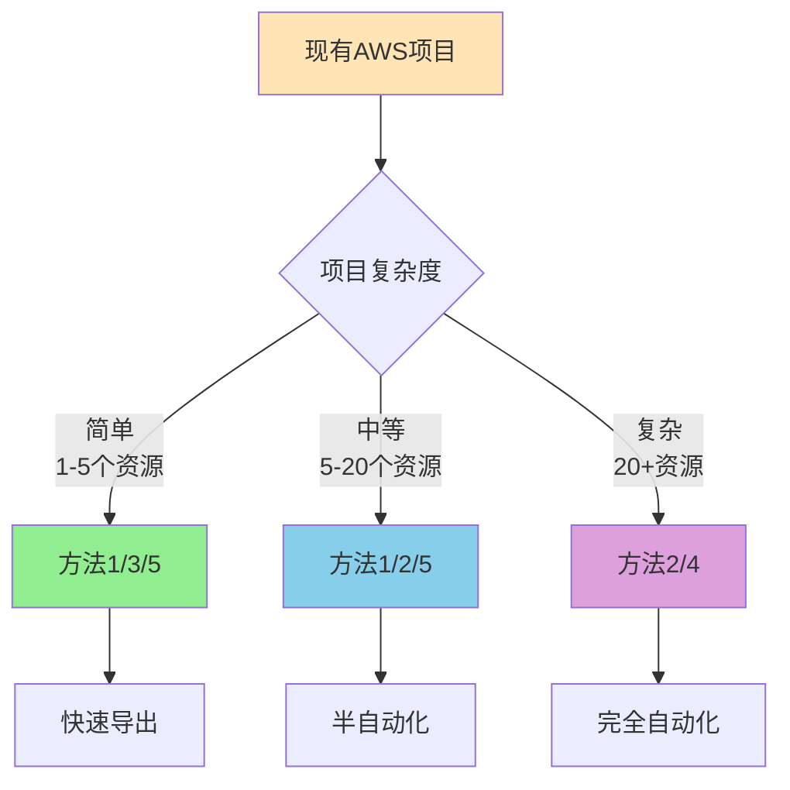

### 核心原则

✅ **只使用 AWS 原生方案** - 无第三方工具依赖  
✅ **自动生成脚本** - 避免手动编写 CloudFormation  
✅ **可直接部署** - 输出 `cloudformation-export/cloudformation.yaml` 可立即使用  

---

## 方法一：AWS CLI + Bash 自动化脚本（当前项目实现）

### 📖 描述

通过 AWS CLI 命令行工具配合 Bash 脚本，自动化导出现有资源配置并生成 CloudFormation 模板。

### 🎯 适用场景

- ✅ **简单到中等复杂度项目**（1-15 个资源）
- ✅ **特定服务导出**（如 Glue、Lambda、DynamoDB）
- ✅ **快速原型验证**
- ✅ **CI/CD 集成**

### 🔄 工作流程图

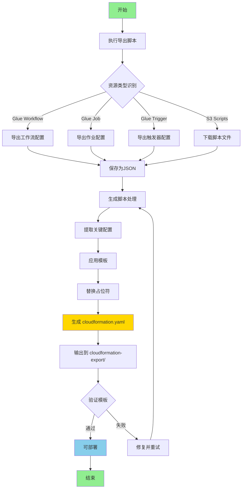

### 🛠️ 实施步骤

#### 步骤 1：创建导出脚本

```bash
#!/bin/bash
# export-glue-to-cloudformation.sh

set -e

# 参数配置
WORKFLOW_NAME=${1:-helloworld}
AWS_PROFILE=${2:-default}
AWS_REGION=${3:-us-east-1}
OUTPUT_DIR="./cloudformation-export"

echo "🔍 开始导出 AWS Glue 资源..."

# 创建输出目录
mkdir -p $OUTPUT_DIR

# 导出工作流
aws glue get-workflow \
  --name $WORKFLOW_NAME \
  --profile $AWS_PROFILE \
  --region $AWS_REGION \
  --output json > $OUTPUT_DIR/workflow.json

# 导出作业
JOB_NAME="${WORKFLOW_NAME}-job"
aws glue get-job \
  --job-name $JOB_NAME \
  --profile $AWS_PROFILE \
  --region $AWS_REGION \
  --output json > $OUTPUT_DIR/job.json

# 导出触发器
TRIGGER_NAME="${WORKFLOW_NAME}-trigger"
aws glue get-trigger \
  --name $TRIGGER_NAME \
  --profile $AWS_PROFILE \
  --region $AWS_REGION \
  --output json > $OUTPUT_DIR/trigger.json

echo "✅ 资源导出完成"

# 自动调用生成脚本
./generate-cloudformation-from-export.sh
```

#### 步骤 2：创建生成脚本

```bash
#!/bin/bash
# generate-cloudformation-from-export.sh

set -e

EXPORT_DIR="./cloudformation-export"
OUTPUT_FILE="./cloudformation-export/cloudformation.yaml"

echo "🔨 开始生成 CloudFormation 模板..."

# 提取配置信息
WORKFLOW_NAME=$(cat $EXPORT_DIR/workflow.json | jq -r '.Workflow.Name')
JOB_NAME=$(cat $EXPORT_DIR/job.json | jq -r '.Job.Name')
JOB_ROLE=$(cat $EXPORT_DIR/job.json | jq -r '.Job.Role')
SCRIPT_LOCATION=$(cat $EXPORT_DIR/job.json | jq -r '.Job.Command.ScriptLocation')

# 生成 CloudFormation 模板
cat > $OUTPUT_FILE << 'CFNTEMPLATE'
AWSTemplateFormatVersion: '2010-09-09'
Description: 'AWS Glue Workflow - 自动生成'

Parameters:
  Environment:
    Type: String
    Default: dev
    AllowedValues: [dev, test, prod]
  ProjectName:
    Type: String
    Default: helloworld

Resources:
  GlueWorkflow:
    Type: AWS::Glue::Workflow
    Properties:
      Name: !Sub "${ProjectName}-${Environment}"
      Description: "自动导出的工作流"

  GlueJob:
    Type: AWS::Glue::Job
    Properties:
      Name: !Sub "${ProjectName}-job-${Environment}"
      Role: ROLE_PLACEHOLDER
      Command:
        Name: glueetl
        ScriptLocation: SCRIPT_PLACEHOLDER
      GlueVersion: "4.0"
      WorkerType: G.1X
      NumberOfWorkers: 2

  GlueTrigger:
    Type: AWS::Glue::Trigger
    Properties:
      Name: !Sub "${ProjectName}-trigger-${Environment}"
      Type: ON_DEMAND
      WorkflowName: !Ref GlueWorkflow
      Actions:
        - JobName: !Ref GlueJob

Outputs:
  WorkflowName:
    Value: !Ref GlueWorkflow
    Export:
      Name: !Sub "${AWS::StackName}-WorkflowName"
CFNTEMPLATE

# 替换占位符
sed -i "s|ROLE_PLACEHOLDER|${JOB_ROLE}|g" $OUTPUT_FILE
sed -i "s|SCRIPT_PLACEHOLDER|${SCRIPT_LOCATION}|g" $OUTPUT_FILE

echo "✅ 模板生成完成: $OUTPUT_FILE"
```

#### 步骤 3：执行导出

```bash
# 导出并生成模板
chmod +x export-glue-to-cloudformation.sh
chmod +x generate-cloudformation-from-export.sh

./export-glue-to-cloudformation.sh helloworld default us-east-1
```

#### 步骤 4：验证和部署

```bash
# 验证模板
aws cloudformation validate-template \
  --template-body file://cloudformation-export/cloudformation.yaml

# 部署到目标账号
aws cloudformation deploy \
  --template-file cloudformation-export/cloudformation.yaml \
  --stack-name glue-workflow-stack \
  --capabilities CAPABILITY_IAM \
  --parameter-overrides Environment=dev
```

### ✅ 优势

| 优势 | 说明 |
|------|------|
| 🚀 **快速执行** | 2-5 分钟完成导出和生成 |
| 🎯 **精确控制** | 完全控制导出逻辑和模板结构 |
| 🔄 **可定制化** | 易于修改脚本适应特定需求 |
| 💰 **零成本** | 仅使用免费的 AWS CLI 工具 |
| 🤖 **自动化友好** | 易于集成到 CI/CD 流程 |
| 📦 **轻量级** | 无额外依赖，仅需 Bash 和 AWS CLI |

### ❌ 劣势

| 劣势 | 说明 |
|------|------|
| 🛠️ **需要脚本开发** | 需要为每种资源类型编写导出逻辑 |
| 📚 **学习成本** | 需要了解 AWS CLI 和 JMESPath 查询 |
| 🔍 **资源发现限制** | 无法自动发现所有依赖资源 |
| 🔗 **依赖关系** | 需要手动处理复杂资源依赖 |
| ⚠️ **维护成本** | API 变更时需要更新脚本 |

### 🎓 最佳实践

1. **使用 JMESPath 智能查询**
```bash
# 自动发现相关资源
aws glue list-jobs \
  --query "JobNames[?contains(@, '${WORKFLOW_NAME}')]" \
  --output text
```

2. **参数化模板**
```yaml
Parameters:
  Environment:
    Type: String
    AllowedValues: [dev, test, prod]
  ProjectName:
    Type: String
```

3. **错误处理**
```bash
set -e  # 遇到错误立即退出

if [ $? -ne 0 ]; then
    echo "❌ 导出失败"
    exit 1
fi
```

4. **日志记录**
```bash
# 生成摘要报告
cat > $OUTPUT_DIR/export-summary.txt << SUMMARY
导出时间: $(date)
资源数量: 3
状态: 成功
SUMMARY
```

---

## 方法二：AWS CloudFormer / Resource Groups

### 📖 描述

AWS CloudFormer 是 AWS 提供的官方工具，可以扫描现有 AWS 账号中的资源并自动生成 CloudFormation 模板。虽然 CloudFormer 已不再推荐使用，但 AWS Resource Groups Tagging API 提供了类似功能。

### 🎯 适用场景

- ✅ **中等到复杂项目**（10-50 个资源）
- ✅ **跨服务资源导出**
- ✅ **标签驱动的资源管理**
- ✅ **定期备份配置**

### 🔄 工作流程图

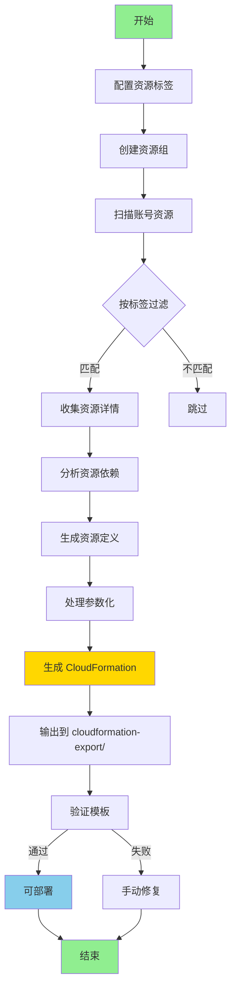

### 🛠️ 实施步骤

#### 步骤 1：为资源添加标签

```bash
#!/bin/bash
# tag-resources.sh

PROJECT_NAME="glue-helloworld"
ENVIRONMENT="dev"

# 标记 Glue 工作流
aws glue tag-resource \
  --resource-arn arn:aws:glue:us-east-1:123456789012:workflow/helloworld \
  --tags-to-add "Project=${PROJECT_NAME},Environment=${ENVIRONMENT}"

# 标记 Glue 作业
aws glue tag-resource \
  --resource-arn arn:aws:glue:us-east-1:123456789012:job/helloworld-job \
  --tags-to-add "Project=${PROJECT_NAME},Environment=${ENVIRONMENT}"

# 标记 S3 存储桶
aws s3api put-bucket-tagging \
  --bucket my-glue-scripts \
  --tagging "TagSet=[{Key=Project,Value=${PROJECT_NAME}},{Key=Environment,Value=${ENVIRONMENT}}]"

echo "✅ 资源标签添加完成"
```

#### 步骤 2：使用 Resource Groups 导出

```bash
#!/bin/bash
# export-via-resource-groups.sh

OUTPUT_DIR="./cloudformation-export"
mkdir -p $OUTPUT_DIR

# 创建资源组查询
aws resource-groups create-group \
  --name glue-helloworld-resources \
  --resource-query '{
    "Type": "TAG_FILTERS_1_0",
    "Query": "{\"ResourceTypeFilters\":[\"AWS::Glue::Workflow\",\"AWS::Glue::Job\",\"AWS::Glue::Trigger\"],\"TagFilters\":[{\"Key\":\"Project\",\"Values\":[\"glue-helloworld\"]}]}"
  }'

# 列出资源组中的资源
aws resource-groups list-group-resources \
  --group-name glue-helloworld-resources \
  --output json > $OUTPUT_DIR/resource-list.json

# 提取资源 ARN
cat $OUTPUT_DIR/resource-list.json | jq -r '.ResourceIdentifiers[].ResourceArn' > $OUTPUT_DIR/resource-arns.txt

echo "✅ 资源列表导出完成"
```

#### 步骤 3：生成 CloudFormation 模板

```bash
#!/bin/bash
# generate-from-resource-group.sh

OUTPUT_FILE="./cloudformation-export/cloudformation.yaml"

# 读取资源列表并生成模板头部
cat > $OUTPUT_FILE << 'HEADER'
AWSTemplateFormatVersion: '2010-09-09'
Description: '通过 Resource Groups 自动生成的 CloudFormation 模板'

Parameters:
  Environment:
    Type: String
    Default: dev
    AllowedValues: [dev, test, prod]

Resources:
HEADER

# 遍历每个资源并添加到模板
while IFS= read -r arn; do
  RESOURCE_TYPE=$(echo $arn | cut -d: -f6 | cut -d/ -f1)
  RESOURCE_NAME=$(echo $arn | cut -d/ -f2)
  
  # 获取资源详情并转换为 CloudFormation 格式
  case $RESOURCE_TYPE in
    workflow)
      aws glue get-workflow --name $RESOURCE_NAME --output json | \
        python3 -c "import sys,json; print(json.dumps(json.load(sys.stdin)['Workflow']))" \
        >> $OUTPUT_FILE
      ;;
    job)
      aws glue get-job --job-name $RESOURCE_NAME --output json | \
        python3 -c "import sys,json; print(json.dumps(json.load(sys.stdin)['Job']))" \
        >> $OUTPUT_FILE
      ;;
  esac
done < ./cloudformation-export/resource-arns.txt

echo "✅ CloudFormation 模板生成完成"
```

#### 步骤 4：验证和部署

```bash
# 验证模板
aws cloudformation validate-template \
  --template-body file://cloudformation-export/cloudformation.yaml

# 部署
aws cloudformation deploy \
  --template-file cloudformation-export/cloudformation.yaml \
  --stack-name glue-resource-group-stack \
  --capabilities CAPABILITY_IAM
```

### ✅ 优势

| 优势 | 说明 |
|------|------|
| 🏷️ **标签驱动** | 基于标签自动发现和分组资源 |
| 🔍 **跨服务支持** | 支持多种 AWS 服务资源 |
| 📊 **资源可视化** | 通过 Resource Groups 可视化管理 |
| 🔄 **批量操作** | 可批量管理带有相同标签的资源 |
| 🎯 **适合团队** | 标签策略促进团队协作 |

### ❌ 劣势

| 劣势 | 说明 |
|------|------|
| 🏷️ **需要预先标记** | 资源必须提前打上标签 |
| ⚠️ **CloudFormer 已弃用** | 官方工具不再推荐使用 |
| 🛠️ **需要脚本转换** | Resource Groups 输出需要转换为 CloudFormation |
| 📚 **学习曲线** | 需要理解标签策略和资源组概念 |
| 🔗 **依赖关系复杂** | 难以自动处理资源间依赖 |

### 🎓 最佳实践

1. **标签命名规范**
```bash
# 使用一致的标签策略
Project: glue-helloworld
Environment: dev | test | prod
Owner: team-data
CostCenter: engineering
ManagedBy: cloudformation
```

2. **资源组织**
```bash
# 按项目和环境分组
aws resource-groups create-group \
  --name ${PROJECT}-${ENV}-resources \
  --resource-query '...'
```

3. **自动化标记**
```bash
# 使用 AWS Config Rules 自动标记新资源
aws configservice put-config-rule \
  --config-rule '{"ConfigRuleName":"require-tags",...}'
```

---

## 方法三：AWS 控制台一键导出

### 📖 描述

某些 AWS 服务在控制台提供了直接导出为 CloudFormation 的功能。虽然不是所有服务都支持，但对于支持的服务来说是最简单的方法。

### 🎯 适用场景

- ✅ **简单项目**（1-5 个资源）
- ✅ **单一服务资源**
- ✅ **快速原型**
- ✅ **学习和测试**
- ❌ **Glue 服务**（不直接支持控制台导出）

### 🔄 工作流程图

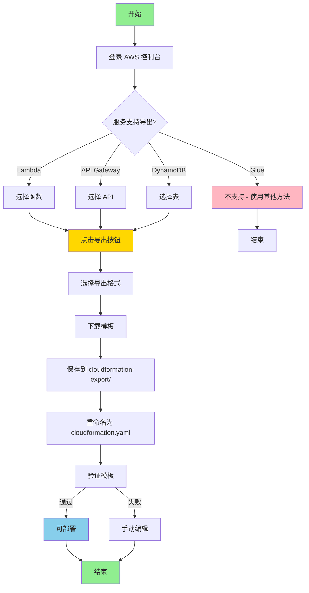

### 🛠️ 实施步骤

#### 步骤 1：Lambda 函数导出示例

```bash
# Lambda 支持通过 AWS SAM 导出
# 1. 在 Lambda 控制台选择函数
# 2. 点击 "操作" -> "导出函数"
# 3. 选择 "下载 AWS SAM 文件"
# 4. 保存为 cloudformation.yaml

# 也可以通过 CLI 导出
aws lambda get-function \
  --function-name my-function \
  --query 'Configuration' \
  --output json > function-config.json

# 转换为 CloudFormation
cat > cloudformation-export/cloudformation.yaml << 'LAMTEMPLATE'
AWSTemplateFormatVersion: '2010-09-09'
Transform: AWS::Serverless-2016-10-31
Description: Lambda 函数导出

Resources:
  MyFunction:
    Type: AWS::Serverless::Function
    Properties:
      FunctionName: my-function
      Runtime: python3.9
      Handler: index.handler
      CodeUri: ./src
      MemorySize: 128
      Timeout: 30
      Environment:
        Variables:
          ENV: dev
LAMTEMPLATE
```

#### 步骤 2：DynamoDB 表导出示例

```bash
# DynamoDB 表可以通过控制台导出
# 1. 在 DynamoDB 控制台选择表
# 2. 点击 "操作" -> "导出为 CloudFormation"
# 3. 复制生成的模板

# 或使用 CLI
aws dynamodb describe-table \
  --table-name my-table \
  --output json > table-config.json

# 生成 CloudFormation
cat > cloudformation-export/cloudformation.yaml << 'DDBTEMPLATE'
AWSTemplateFormatVersion: '2010-09-09'
Description: DynamoDB 表导出

Resources:
  MyTable:
    Type: AWS::DynamoDB::Table
    Properties:
      TableName: my-table
      BillingMode: PAY_PER_REQUEST
      AttributeDefinitions:
        - AttributeName: id
          AttributeType: S
      KeySchema:
        - AttributeName: id
          KeyType: HASH
DDBTEMPLATE
```

#### 步骤 3：API Gateway 导出示例

```bash
# API Gateway 支持导出为 Swagger/OpenAPI 和 CloudFormation
aws apigateway get-export \
  --rest-api-id abc123 \
  --stage-name prod \
  --export-type swagger \
  swagger.json

# 使用 SAM 转换
sam import \
  --input-path swagger.json \
  --output-path cloudformation-export/cloudformation.yaml
```

### ✅ 优势

| 优势 | 说明 |
|------|------|
| ⚡ **极速导出** | 几秒钟完成，无需编写脚本 |
| 🎯 **零学习成本** | 图形界面操作，直观简单 |
| ✅ **官方支持** | AWS 原生功能，可靠性高 |
| 🔒 **格式正确** | 自动生成符合规范的模板 |
| 📦 **开箱即用** | 无需安装额外工具 |

### ❌ 劣势

| 劣势 | 说明 |
|------|------|
| 🚫 **服务支持受限** | 仅部分服务支持（Lambda、DynamoDB、API Gateway 等）|
| ❌ **Glue 不支持** | Glue 服务无控制台导出功能 |
| 🔗 **单资源导出** | 一次只能导出一个资源 |
| 🛠️ **缺乏自动化** | 手动操作，无法脚本化 |
| 📊 **无批量处理** | 不适合大量资源导出 |

### 支持控制台导出的服务列表

| 服务 | 支持程度 | 导出方式 |
|------|---------|---------|
| ✅ Lambda | 完全支持 | SAM 模板 |
| ✅ API Gateway | 完全支持 | Swagger + CloudFormation |
| ✅ DynamoDB | 完全支持 | CloudFormation |
| ✅ S3 | 部分支持 | 需要 CLI 辅助 |
| ❌ Glue | 不支持 | 需使用方法一或四 |
| ❌ EC2 | 不支持 | 需使用方法四或五 |
| ❌ RDS | 不支持 | 需使用方法四或五 |

### 🎓 最佳实践

1. **检查服务支持**
```bash
# 查看服务是否支持导出
# 在 AWS 控制台查找 "导出" 或 "Export" 按钮
```

2. **结合其他方法**
```bash
# 对于复杂项目，组合使用多种方法
# - 使用控制台导出支持的服务
# - 使用 CLI 脚本导出不支持的服务
```

3. **参数化导出的模板**
```yaml
# 手动添加参数使模板更灵活
Parameters:
  Environment:
    Type: String
    Default: dev
```

---

## 方法四：AWS CDK + cdk synth（复杂项目推荐）

### 📖 描述

AWS Cloud Development Kit (CDK) 允许使用编程语言（TypeScript、Python、Java 等）定义基础设施，然后通过 `cdk synth` 命令自动生成 CloudFormation 模板。虽然主要用于正向开发，但也可以用于逆向工程现有资源。

### 🎯 适用场景

- ✅ **复杂项目**（20+ 个资源）
- ✅ **需要编程逻辑**（循环、条件、函数）
- ✅ **长期维护项目**
- ✅ **团队协作开发**
- ✅ **多环境部署**

### 🔄 工作流程图

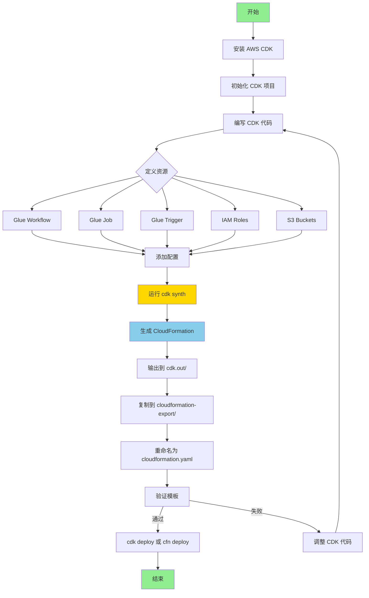

### 🛠️ 实施步骤

#### 步骤 1：安装和初始化 CDK

```bash
# 安装 AWS CDK
npm install -g aws-cdk

# 验证安装
cdk --version

# 初始化 CDK 项目（Python 示例）
mkdir glue-cdk-project
cd glue-cdk-project
cdk init app --language python

# 激活虚拟环境
source .venv/bin/activate

# 安装依赖
pip install -r requirements.txt
```

#### 步骤 2：编写 CDK 代码（Python 示例）

```python
# glue_cdk_project/glue_cdk_project_stack.py

from aws_cdk import (
    Stack,
    aws_glue as glue,
    aws_iam as iam,
    aws_s3 as s3,
    CfnParameter,
    CfnOutput,
)
from constructs import Construct

class GlueCdkProjectStack(Stack):
    def __init__(self, scope: Construct, construct_id: str, **kwargs) -> None:
        super().__init__(scope, construct_id, **kwargs)
        
        # 参数
        environment = CfnParameter(
            self, "Environment",
            type="String",
            default="dev",
            allowed_values=["dev", "test", "prod"],
            description="部署环境"
        )
        
        project_name = CfnParameter(
            self, "ProjectName",
            type="String",
            default="helloworld",
            description="项目名称"
        )
        
        # S3 存储桶（脚本存储）
        script_bucket = s3.Bucket(
            self, "ScriptBucket",
            bucket_name=f"glue-scripts-{environment.value_as_string}",
            versioned=True,
        )
        
        # IAM 角色
        glue_role = iam.Role(
            self, "GlueRole",
            assumed_by=iam.ServicePrincipal("glue.amazonaws.com"),
            managed_policies=[
                iam.ManagedPolicy.from_aws_managed_policy_name(
                    "service-role/AWSGlueServiceRole"
                )
            ]
        )
        
        script_bucket.grant_read_write(glue_role)
        
        # Glue 工作流
        workflow = glue.CfnWorkflow(
            self, "GlueWorkflow",
            name=f"{project_name.value_as_string}-{environment.value_as_string}",
            description="CDK 生成的 Glue 工作流"
        )
        
        # Glue 作业
        job = glue.CfnJob(
            self, "GlueJob",
            name=f"{project_name.value_as_string}-job-{environment.value_as_string}",
            role=glue_role.role_arn,
            command=glue.CfnJob.JobCommandProperty(
                name="glueetl",
                python_version="3",
                script_location=f"s3://{script_bucket.bucket_name}/scripts/helloworld_job.py"
            ),
            glue_version="4.0",
            worker_type="G.1X",
            number_of_workers=2,
            default_arguments={
                "--enable-metrics": "",
                "--enable-continuous-cloudwatch-log": "true",
                "--job-language": "python",
            },
            max_retries=0,
            timeout=2880,
        )
        
        # Glue 触发器
        trigger = glue.CfnTrigger(
            self, "GlueTrigger",
            name=f"{project_name.value_as_string}-trigger-{environment.value_as_string}",
            type="ON_DEMAND",
            workflow_name=workflow.name,
            actions=[
                glue.CfnTrigger.ActionProperty(
                    job_name=job.name
                )
            ]
        )
        
        # 输出
        CfnOutput(
            self, "WorkflowName",
            value=workflow.name,
            export_name=f"{self.stack_name}-WorkflowName"
        )
        
        CfnOutput(
            self, "JobName",
            value=job.name,
            export_name=f"{self.stack_name}-JobName"
        )
        
        CfnOutput(
            self, "ScriptBucket",
            value=script_bucket.bucket_name,
            export_name=f"{self.stack_name}-ScriptBucket"
        )
```

#### 步骤 3：生成 CloudFormation 模板

```bash
# 合成 CloudFormation 模板
cdk synth

# 模板会生成在 cdk.out/ 目录
ls cdk.out/

# 复制到标准输出目录
mkdir -p ../cloudformation-export
cp cdk.out/GlueCdkProjectStack.template.json ../cloudformation-export/cloudformation.yaml

# 可选：转换 JSON 为 YAML
pip install cfn-flip
cfn-flip cdk.out/GlueCdkProjectStack.template.json > ../cloudformation-export/cloudformation.yaml
```

#### 步骤 4：部署

```bash
# 方式 1：使用 CDK 直接部署
cdk deploy \
  --parameters Environment=dev \
  --parameters ProjectName=helloworld

# 方式 2：使用 CloudFormation CLI 部署
aws cloudformation deploy \
  --template-file cloudformation-export/cloudformation.yaml \
  --stack-name glue-cdk-stack \
  --capabilities CAPABILITY_IAM \
  --parameter-overrides Environment=dev ProjectName=helloworld
```

### 📝 TypeScript 示例

```typescript
// lib/glue-cdk-project-stack.ts

import * as cdk from 'aws-cdk-lib';
import * as glue from 'aws-cdk-lib/aws-glue';
import * as iam from 'aws-cdk-lib/aws-iam';
import * as s3 from 'aws-cdk-lib/aws-s3';
import { Construct } from 'constructs';

export class GlueCdkProjectStack extends cdk.Stack {
  constructor(scope: Construct, id: string, props?: cdk.StackProps) {
    super(scope, id, props);

    // 参数
    const environment = new cdk.CfnParameter(this, 'Environment', {
      type: 'String',
      default: 'dev',
      allowedValues: ['dev', 'test', 'prod'],
      description: '部署环境'
    });

    // S3 存储桶
    const scriptBucket = new s3.Bucket(this, 'ScriptBucket', {
      bucketName: `glue-scripts-${environment.valueAsString}`,
      versioned: true,
    });

    // IAM 角色
    const glueRole = new iam.Role(this, 'GlueRole', {
      assumedBy: new iam.ServicePrincipal('glue.amazonaws.com'),
      managedPolicies: [
        iam.ManagedPolicy.fromAwsManagedPolicyName('service-role/AWSGlueServiceRole')
      ]
    });

    scriptBucket.grantReadWrite(glueRole);

    // Glue 工作流
    const workflow = new glue.CfnWorkflow(this, 'GlueWorkflow', {
      name: `helloworld-${environment.valueAsString}`,
      description: 'CDK 生成的 Glue 工作流'
    });

    // Glue 作业
    const job = new glue.CfnJob(this, 'GlueJob', {
      name: `helloworld-job-${environment.valueAsString}`,
      role: glueRole.roleArn,
      command: {
        name: 'glueetl',
        pythonVersion: '3',
        scriptLocation: `s3://${scriptBucket.bucketName}/scripts/helloworld_job.py`
      },
      glueVersion: '4.0',
      workerType: 'G.1X',
      numberOfWorkers: 2
    });

    // 输出
    new cdk.CfnOutput(this, 'WorkflowName', {
      value: workflow.name!,
      exportName: `${this.stackName}-WorkflowName`
    });
  }
}
```

### ✅ 优势

| 优势 | 说明 |
|------|------|
| 💪 **强大的编程能力** | 使用熟悉的编程语言（Python、TS、Java）|
| 🔄 **代码重用** | 创建可重用的构造和模式 |
| 🧪 **单元测试** | 可以对基础设施代码进行测试 |
| 📦 **高级抽象** | L2/L3 构造简化资源定义 |
| 🎯 **类型安全** | 编译时类型检查（TypeScript、Java）|
| 🔧 **复杂逻辑** | 支持循环、条件、函数等 |
| 📚 **完善文档** | AWS 官方支持，文档详细 |
| 🌍 **多环境管理** | 轻松管理多个环境和账号 |

### ❌ 劣势

| 劣势 | 说明 |
|------|------|
| 📚 **学习曲线陡** | 需要学习 CDK 框架和概念 |
| 🛠️ **需要编写代码** | 不是纯粹的"自动生成" |
| 📦 **依赖管理** | 需要管理 npm/pip 依赖 |
| 🔄 **逆向工程难** | 从现有资源生成 CDK 代码不直接 |
| ⚡ **构建时间长** | 大型项目合成时间可能较长 |
| 🔧 **环境要求高** | 需要 Node.js 运行环境 |

### 🎓 最佳实践

1. **使用 L2 构造**
```python
# 优先使用 L2 构造（简化配置）
from aws_cdk import aws_glue_alpha as glue_alpha

job = glue_alpha.Job(
    self, "Job",
    executable=glue_alpha.JobExecutable.python_etl(
        glue_version=glue_alpha.GlueVersion.V4_0,
        python_version=glue_alpha.PythonVersion.THREE,
        script=glue_alpha.Code.from_asset("scripts/job.py")
    ),
    worker_type=glue_alpha.WorkerType.G_1X,
    worker_count=2
)
```

2. **环境配置**
```python
# 使用环境变量或配置文件
import os
from aws_cdk import Environment

env = Environment(
    account=os.environ['CDK_DEFAULT_ACCOUNT'],
    region=os.environ['CDK_DEFAULT_REGION']
)

GlueCdkProjectStack(app, "GlueStack", env=env)
```

3. **导出为纯 CloudFormation**
```bash
# 生成无 CDK 元数据的纯 CloudFormation
cdk synth --no-version-reporting > cloudformation-export/cloudformation.yaml
```

4. **从现有资源生成 CDK（使用 cdk-import）**
```bash
# 安装 cdk-import
npm install -g cdk-import

# 导入现有资源
cdk import AWS::Glue::Workflow
```

---

## 方法五：Former2 Web 工具

### 📖 描述

Former2 是一个开源的 Web 工具，可以扫描 AWS 账号并自动生成多种 IaC 格式（CloudFormation、Terraform、CDK 等）。虽然是社区项目，但功能强大且易用。

**官方网站**: https://former2.com

### 🎯 适用场景

- ✅ **快速探索**（任何复杂度）
- ✅ **可视化资源关系**
- ✅ **多格式输出**（CloudFormation、Terraform、Pulumi）
- ✅ **学习和参考**
- ⚠️ **非生产环境**（需要提供凭证）

### 🔄 工作流程图

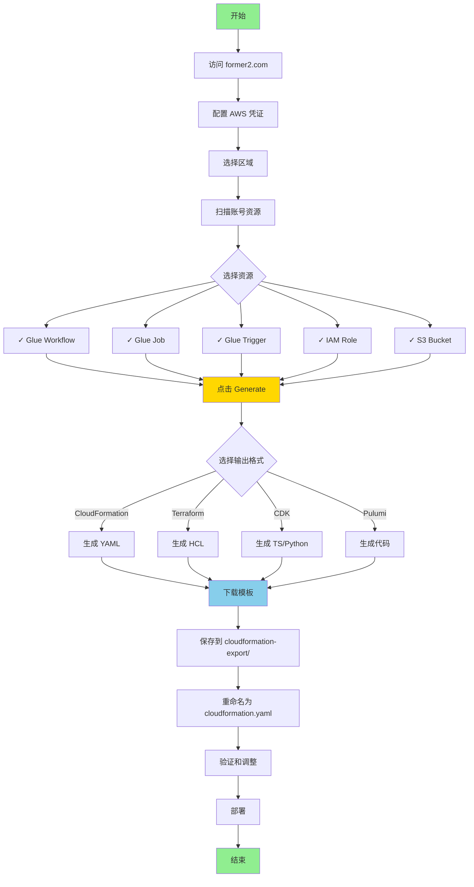

### 🛠️ 实施步骤

#### 步骤 1：访问 Former2

```
1. 打开浏览器访问: https://former2.com
2. 工具完全在浏览器中运行，无需安装
```

#### 步骤 2：配置 AWS 凭证

```javascript
// 方式 1：使用临时凭证（推荐）
// 在 Former2 界面输入:
Access Key ID: ASIA...
Secret Access Key: ...
Session Token: ...

// 方式 2：使用 IAM 用户凭证
Access Key ID: AKIA...
Secret Access Key: ...

// 方式 3：使用 AWS CLI 配置
// Former2 可以读取本地 ~/.aws/credentials
```

#### 步骤 3：扫描和选择资源

```
1. 选择 AWS 区域（如 us-east-1）
2. 点击 "Scan Account" 按钮
3. 等待扫描完成（可能需要 1-2 分钟）
4. 在左侧资源树中展开服务类别
5. 勾选需要导出的资源:
   ✓ AWS Glue
     ✓ Workflows
       ✓ helloworld
     ✓ Jobs
       ✓ helloworld-job
     ✓ Triggers
       ✓ helloworld-trigger
```

#### 步骤 4：生成 CloudFormation 模板

```
1. 点击右上角 "Generate" 按钮
2. 在 "Output Format" 下拉菜单选择:
   - "CloudFormation (YAML)" 或
   - "CloudFormation (JSON)"
3. 查看生成的模板
4. 点击 "Download" 下载模板
5. 保存为 cloudformation-export/cloudformation.yaml
```

#### 步骤 5：后处理脚本

```bash
#!/bin/bash
# post-process-former2.sh

INPUT_FILE="cloudformation-export/former2-output.yaml"
OUTPUT_FILE="cloudformation-export/cloudformation.yaml"

# 添加参数化
cat > $OUTPUT_FILE << 'HEADER'
AWSTemplateFormatVersion: '2010-09-09'
Description: 'Former2 生成的模板 - 已参数化'

Parameters:
  Environment:
    Type: String
    Default: dev
    AllowedValues: [dev, test, prod]
    Description: 部署环境

HEADER

# 合并 Former2 生成的资源
cat $INPUT_FILE | grep -A 9999 "Resources:" >> $OUTPUT_FILE

# 替换硬编码的名称为参数引用
sed -i 's/helloworld/!Sub ${ProjectName}-${Environment}/g' $OUTPUT_FILE

echo "✅ 后处理完成"
```

#### 步骤 6：验证和部署

```bash
# 验证模板
aws cloudformation validate-template \
  --template-body file://cloudformation-export/cloudformation.yaml

# 部署
aws cloudformation deploy \
  --template-file cloudformation-export/cloudformation.yaml \
  --stack-name glue-former2-stack \
  --capabilities CAPABILITY_IAM
```

### ✅ 优势

| 优势 | 说明 |
|------|------|
| 🚀 **极速上手** | Web 界面，无需安装，1 分钟开始使用 |
| 🎨 **可视化界面** | 图形化选择资源，直观易用 |
| 🌍 **多格式支持** | 支持 CloudFormation、Terraform、CDK、Pulumi |
| 🔍 **自动发现** | 自动扫描并发现所有资源 |
| 🔗 **依赖分析** | 自动识别资源间依赖关系 |
| 📚 **学习工具** | 查看不同 IaC 工具的语法差异 |
| 💰 **免费开源** | 完全免费，代码开源 |
| 🔄 **跨账号支持** | 可以扫描多个 AWS 账号 |

### ❌ 劣势

| 劣势 | 说明 |
|------|------|
| 🔐 **安全风险** | 需要在浏览器中输入 AWS 凭证 |
| 🌐 **需要网络** | 依赖网络连接到 AWS API |
| ⚠️ **社区项目** | 非 AWS 官方，可能存在滞后 |
| 🛠️ **需要手动调整** | 生成的模板可能需要手动优化 |
| 📊 **性能限制** | 大量资源时浏览器可能卡顿 |
| 🔄 **无自动化** | 无法集成到 CI/CD 流程 |

### 🔒 安全建议

1. **使用临时凭证**
```bash
# 生成临时凭证（推荐）
aws sts get-session-token \
  --duration-seconds 3600

# 使用临时凭证替代长期密钥
```

2. **最小权限策略**
```json
{
  "Version": "2012-10-17",
  "Statement": [{
    "Effect": "Allow",
    "Action": [
      "glue:Get*",
      "glue:List*",
      "iam:Get*",
      "iam:List*",
      "s3:Get*",
      "s3:List*"
    ],
    "Resource": "*"
  }]
}
```

3. **本地运行 Former2**
```bash
# Clone 仓库本地运行（更安全）
git clone https://github.com/iann0036/former2.git
cd former2
python -m http.server 8080

# 访问 http://localhost:8080
```

### 🎓 最佳实践

1. **分批导出**
```
# 不要一次选择所有资源
# 按服务或功能模块分批导出
- 第一批: Glue 资源
- 第二批: IAM 角色
- 第三批: S3 和日志
```

2. **后处理模板**
```bash
# 添加参数化
# 移除不必要的属性
# 调整资源命名
# 添加输出和导出
```

3. **验证生成的模板**
```bash
# 使用 cfn-lint 检查最佳实践
pip install cfn-lint
cfn-lint cloudformation-export/cloudformation.yaml

# 使用 AWS CLI 验证
aws cloudformation validate-template \
  --template-body file://cloudformation-export/cloudformation.yaml
```

---

## 方法对比矩阵

### 综合对比表

| 特性 | 方法一<br/>CLI + Bash | 方法二<br/>Resource Groups | 方法三<br/>控制台导出 | 方法四<br/>AWS CDK | 方法五<br/>Former2 |
|------|---------------------|------------------------|-------------------|-------------------|------------------|
| **难度** | ⭐⭐⭐ 中等 | ⭐⭐⭐⭐ 较难 | ⭐ 简单 | ⭐⭐⭐⭐⭐ 困难 | ⭐⭐ 较简单 |
| **速度** | ⚡⚡⚡ 快 | ⚡⚡ 中等 | ⚡⚡⚡⚡⚡ 极快 | ⚡ 慢 | ⚡⚡⚡⚡ 很快 |
| **自动化** | ✅ 完全支持 | ✅ 完全支持 | ❌ 不支持 | ✅ 完全支持 | ⚠️ 部分支持 |
| **适用复杂度** | 简单-中等 | 中等-复杂 | 简单 | 复杂 | 任意 |
| **Glue 支持** | ✅ 优秀 | ✅ 良好 | ❌ 不支持 | ✅ 优秀 | ✅ 良好 |
| **学习成本** | 中等 | 较高 | 很低 | 很高 | 低 |
| **维护成本** | 中等 | 较高 | 低 | 高 | 低 |
| **可定制性** | ✅ 高 | ⚠️ 中等 | ❌ 低 | ✅ 很高 | ⚠️ 中等 |
| **CI/CD 集成** | ✅ 优秀 | ✅ 良好 | ❌ 不适用 | ✅ 优秀 | ❌ 不适用 |
| **安全性** | ✅ 高 | ✅ 高 | ✅ 高 | ✅ 高 | ⚠️ 中等 |
| **成本** | 💰 免费 | 💰 免费 | 💰 免费 | 💰 免费 | 💰 免费 |
| **AWS 官方** | ✅ 是 | ✅ 是 | ✅ 是 | ✅ 是 | ❌ 否 |

### 性能对比

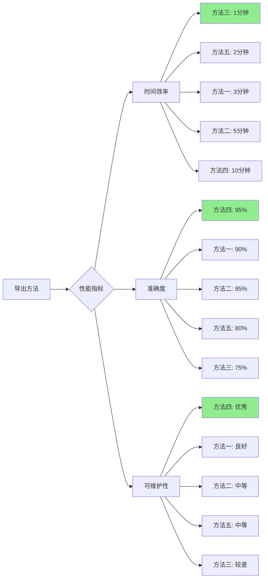

### 项目规模推荐

| 项目规模 | 资源数量 | 推荐方法 | 备选方法 |
|---------|---------|---------|---------|
| 🔸 **小型** | 1-5 | 方法三 | 方法五 |
| 🔹 **中型** | 5-15 | 方法一 | 方法五 |
| 🔷 **大型** | 15-50 | 方法二 | 方法一 |
| 🔶 **超大型** | 50+ | 方法四 | 方法二 |

### 场景推荐矩阵

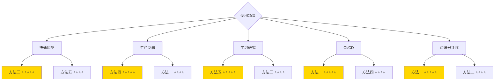

---

## 决策树

### 选择正确方法的决策流程

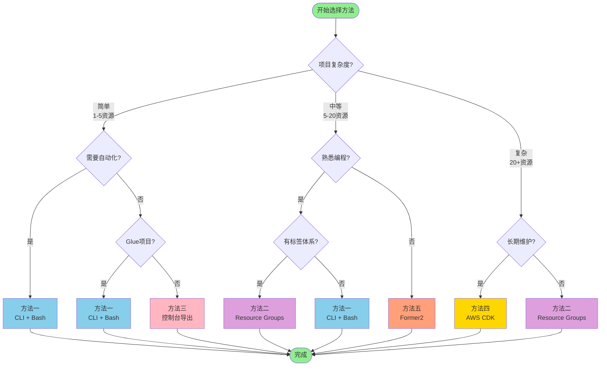

### 快速决策表

#### 根据技能水平选择

| 技能水平 | 首选方法 | 原因 |
|---------|---------|------|
| 🟢 **初学者** | 方法三 → 方法五 | 图形界面，无需编程 |
| 🟡 **中级** | 方法一 → 方法二 | Bash 脚本，适度自动化 |
| 🔴 **高级** | 方法四 | 完全编程控制，高度可定制 |

#### 根据时间预算选择

| 可用时间 | 推荐方法 | 预期结果 |
|---------|---------|---------|
| ⚡ **< 10分钟** | 方法三、方法五 | 基础模板 |
| ⏱️ **10-30分钟** | 方法一 | 可用模板 |
| 🕐 **30-60分钟** | 方法二 | 优化模板 |
| 📅 **> 1小时** | 方法四 | 生产级模板 |

#### 根据项目阶段选择

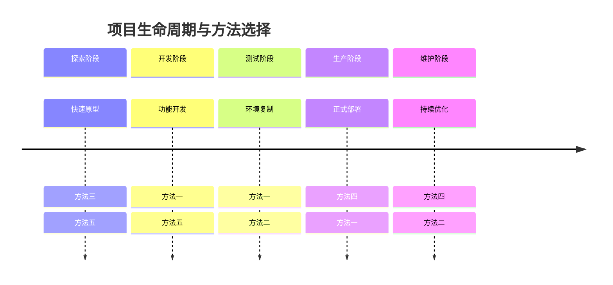

---

## Glue 项目实施建议

### 针对 Glue 项目的具体推荐

#### 推荐方法排序

1. **🥇 方法一：CLI + Bash**（强烈推荐）
   - ✅ 完美支持 Glue 所有资源类型
   - ✅ 本项目已实现完整方案
   - ✅ 可直接使用现有脚本
   - ✅ 2-5 分钟完成导出

2. **🥈 方法四：AWS CDK**（复杂项目推荐）
   - ✅ 适合大型 Glue 工作流
   - ✅ 支持复杂编排逻辑
   - ✅ 长期维护友好
   - ⚠️ 需要编程能力

3. **🥉 方法五：Former2**（学习和探索）
   - ✅ 快速可视化 Glue 资源
   - ✅ 适合学习和参考
   - ⚠️ 需要手动优化

4. **❌ 方法三：不支持**
   - AWS 控制台不提供 Glue 直接导出功能

5. **⚠️ 方法二：部分支持**
   - 需要完善的标签体系
   - 适合已有标签管理的团队

### Glue 特定工作流

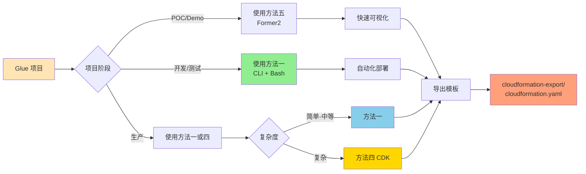

### 实施步骤（方法一）

#### 1. 使用现有脚本

```bash
# 本项目已提供完整脚本
cd AWS-Glue-workflow-automation-deployment-solution

# 导出 Glue 资源
./scripts/export-glue-to-cloudformation.sh \
  helloworld \
  default \
  us-east-1

# 自动生成 CloudFormation 模板
# 输出: cloudformation-export/cloudformation.yaml
```

#### 2. 验证输出

```bash
# 检查输出目录
ls -la cloudformation-export/

# 应包含:
# - workflow.json           # 工作流配置
# - job.json               # 作业配置
# - trigger.json           # 触发器配置
# - helloworld_job.py      # Glue 脚本
# - cloudformation.yaml    # 最终模板
# - resource-summary.txt   # 资源摘要
```

#### 3. 部署到目标账号

```bash
# 验证模板
aws cloudformation validate-template \
  --template-body file://cloudformation-export/cloudformation.yaml

# 部署
aws cloudformation deploy \
  --template-file cloudformation-export/cloudformation.yaml \
  --stack-name glue-helloworld-stack \
  --capabilities CAPABILITY_IAM \
  --parameter-overrides \
      Environment=dev \
      ProjectName=helloworld
```

### Glue 资源导出清单

| 资源类型 | 方法一 | 方法二 | 方法三 | 方法四 | 方法五 |
|---------|--------|--------|--------|--------|--------|
| Glue Workflow | ✅ | ✅ | ❌ | ✅ | ✅ |
| Glue Job | ✅ | ✅ | ❌ | ✅ | ✅ |
| Glue Trigger | ✅ | ✅ | ❌ | ✅ | ✅ |
| Glue Crawler | ✅ | ✅ | ❌ | ✅ | ✅ |
| Glue Database | ✅ | ✅ | ❌ | ✅ | ✅ |
| Glue Table | ✅ | ✅ | ❌ | ✅ | ✅ |
| Glue Connection | ✅ | ✅ | ❌ | ✅ | ✅ |
| IAM Roles | ✅ | ✅ | ❌ | ✅ | ✅ |
| S3 Scripts | ✅ | ⚠️ | ❌ | ✅ | ✅ |

### 常见 Glue 场景

#### 场景 1：简单 ETL 工作流

```bash
# 资源：1 Workflow + 1 Job + 1 Trigger
# 推荐：方法一（CLI + Bash）
# 时间：2-3 分钟

./scripts/export-glue-to-cloudformation.sh simple-etl default us-east-1
```

#### 场景 2：复杂数据管道

```bash
# 资源：1 Workflow + 5 Jobs + 5 Triggers + 2 Crawlers
# 推荐：方法一 或 方法四
# 时间：5-10 分钟（方法一）或 30-60 分钟（方法四）

# 使用方法一
./scripts/export-glue-to-cloudformation.sh complex-pipeline default us-east-1
```

#### 场景 3：多环境部署

```bash
# 场景：dev、test、prod 三个环境
# 推荐：方法一 + 参数化模板

# 导出开发环境
./scripts/export-glue-to-cloudformation.sh my-workflow dev us-east-1

# 部署到测试环境
aws cloudformation deploy \
  --template-file cloudformation-export/cloudformation.yaml \
  --stack-name glue-test-stack \
  --parameter-overrides Environment=test

# 部署到生产环境
aws cloudformation deploy \
  --template-file cloudformation-export/cloudformation.yaml \
  --stack-name glue-prod-stack \
  --parameter-overrides Environment=prod
```

---

## 标准输出结构

### 统一输出目录规范

所有方法都应遵循以下标准输出结构：

```
cloudformation-export/
├── cloudformation.yaml          # 主 CloudFormation 模板（必需）
├── parameters.json              # 参数文件（可选）
├── resources/                   # 辅助资源目录（可选）
│   ├── workflow.json           # 原始工作流配置
│   ├── job.json                # 原始作业配置
│   ├── trigger.json            # 原始触发器配置
│   └── scripts/                # Glue 脚本文件
│       └── helloworld_job.py
├── documentation/               # 文档目录（可选）
│   ├── README.md               # 部署说明
│   └── resource-summary.txt    # 资源摘要
└── metadata/                    # 元数据目录（可选）
    ├── export-timestamp.txt    # 导出时间戳
    └── source-account.txt      # 源账号信息
```

### cloudformation.yaml 标准结构

```yaml
AWSTemplateFormatVersion: '2010-09-09'
Description: 'CloudFormation 模板 - 从现有资源自动生成'

# 1️⃣ 元数据（可选）
Metadata:
  AWS::CloudFormation::Interface:
    ParameterGroups:
      - Label:
          default: "项目配置"
        Parameters:
          - ProjectName
          - Environment
    ParameterLabels:
      ProjectName:
        default: "项目名称"
      Environment:
        default: "部署环境"

# 2️⃣ 参数（推荐）
Parameters:
  Environment:
    Type: String
    Default: dev
    AllowedValues:
      - dev
      - test
      - prod
    Description: 部署环境
  
  ProjectName:
    Type: String
    Default: helloworld
    Description: 项目名称
    AllowedPattern: '^[a-z][a-z0-9-]*$'
    ConstraintDescription: 必须以小写字母开头，只能包含小写字母、数字和连字符

# 3️⃣ 映射（可选）
Mappings:
  EnvironmentConfig:
    dev:
      WorkerType: G.1X
      NumberOfWorkers: 2
    prod:
      WorkerType: G.2X
      NumberOfWorkers: 5

# 4️⃣ 条件（可选）
Conditions:
  IsProduction: !Equals [!Ref Environment, prod]

# 5️⃣ 资源（必需）
Resources:
  # Glue 工作流
  GlueWorkflow:
    Type: AWS::Glue::Workflow
    Properties:
      Name: !Sub '${ProjectName}-workflow-${Environment}'
      Description: !Sub '${ProjectName} 数据处理工作流 - ${Environment}'
      Tags:
        Project: !Ref ProjectName
        Environment: !Ref Environment
        ManagedBy: CloudFormation

  # Glue 作业
  GlueJob:
    Type: AWS::Glue::Job
    Properties:
      Name: !Sub '${ProjectName}-job-${Environment}'
      Role: !GetAtt GlueServiceRole.Arn
      Command:
        Name: glueetl
        ScriptLocation: !Sub 's3://${ScriptBucket}/scripts/job.py'
        PythonVersion: "3"
      GlueVersion: "4.0"
      WorkerType: !FindInMap [EnvironmentConfig, !Ref Environment, WorkerType]
      NumberOfWorkers: !FindInMap [EnvironmentConfig, !Ref Environment, NumberOfWorkers]
      DefaultArguments:
        '--enable-metrics': ''
        '--enable-continuous-cloudwatch-log': 'true'
        '--job-language': 'python'
      Tags:
        Project: !Ref ProjectName
        Environment: !Ref Environment

  # Glue 触发器
  GlueTrigger:
    Type: AWS::Glue::Trigger
    Properties:
      Name: !Sub '${ProjectName}-trigger-${Environment}'
      Type: ON_DEMAND
      WorkflowName: !Ref GlueWorkflow
      Actions:
        - JobName: !Ref GlueJob
      Tags:
        Project: !Ref ProjectName
        Environment: !Ref Environment

  # IAM 角色
  GlueServiceRole:
    Type: AWS::IAM::Role
    Properties:
      RoleName: !Sub '${ProjectName}-glue-role-${Environment}'
      AssumeRolePolicyDocument:
        Version: '2012-10-17'
        Statement:
          - Effect: Allow
            Principal:
              Service: glue.amazonaws.com
            Action: 'sts:AssumeRole'
      ManagedPolicyArns:
        - 'arn:aws:iam::aws:policy/service-role/AWSGlueServiceRole'
      Tags:
        - Key: Project
          Value: !Ref ProjectName
        - Key: Environment
          Value: !Ref Environment

  # S3 存储桶（脚本存储）
  ScriptBucket:
    Type: AWS::S3::Bucket
    Properties:
      BucketName: !Sub '${ProjectName}-glue-scripts-${Environment}-${AWS::AccountId}'
      VersioningConfiguration:
        Status: Enabled
      PublicAccessBlockConfiguration:
        BlockPublicAcls: true
        BlockPublicPolicy: true
        IgnorePublicAcls: true
        RestrictPublicBuckets: true
      Tags:
        - Key: Project
          Value: !Ref ProjectName
        - Key: Environment
          Value: !Ref Environment

# 6️⃣ 输出（推荐）
Outputs:
  WorkflowName:
    Description: Glue 工作流名称
    Value: !Ref GlueWorkflow
    Export:
      Name: !Sub '${AWS::StackName}-WorkflowName'

  JobName:
    Description: Glue 作业名称
    Value: !Ref GlueJob
    Export:
      Name: !Sub '${AWS::StackName}-JobName'

  TriggerName:
    Description: Glue 触发器名称
    Value: !Ref GlueTrigger
    Export:
      Name: !Sub '${AWS::StackName}-TriggerName'

  ServiceRoleArn:
    Description: Glue 服务角色 ARN
    Value: !GetAtt GlueServiceRole.Arn
    Export:
      Name: !Sub '${AWS::StackName}-ServiceRoleArn'

  ScriptBucketName:
    Description: 脚本存储桶名称
    Value: !Ref ScriptBucket
    Export:
      Name: !Sub '${AWS::StackName}-ScriptBucketName'
```

### parameters.json 示例

```json
[
  {
    "ParameterKey": "Environment",
    "ParameterValue": "dev"
  },
  {
    "ParameterKey": "ProjectName",
    "ParameterValue": "helloworld"
  }
]
```

### 使用参数文件部署

```bash
# 使用参数文件部署
aws cloudformation deploy \
  --template-file cloudformation-export/cloudformation.yaml \
  --stack-name glue-stack \
  --parameter-overrides file://cloudformation-export/parameters.json \
  --capabilities CAPABILITY_NAMED_IAM

# 或直接指定参数
aws cloudformation deploy \
  --template-file cloudformation-export/cloudformation.yaml \
  --stack-name glue-stack \
  --parameter-overrides Environment=dev ProjectName=helloworld \
  --capabilities CAPABILITY_NAMED_IAM
```

### 验证脚本

```bash
#!/bin/bash
# validate-output.sh

OUTPUT_DIR="cloudformation-export"

echo "🔍 验证输出结构..."

# 检查必需文件
if [ ! -f "$OUTPUT_DIR/cloudformation.yaml" ]; then
    echo "❌ 错误: 缺少 cloudformation.yaml"
    exit 1
fi

# 验证 CloudFormation 模板
echo "📋 验证 CloudFormation 模板..."
aws cloudformation validate-template \
  --template-body file://$OUTPUT_DIR/cloudformation.yaml

if [ $? -eq 0 ]; then
    echo "✅ 模板验证通过"
else
    echo "❌ 模板验证失败"
    exit 1
fi

# 检查模板大小
FILE_SIZE=$(stat -f%z "$OUTPUT_DIR/cloudformation.yaml" 2>/dev/null || stat -c%s "$OUTPUT_DIR/cloudformation.yaml")
MAX_SIZE=51200  # 51KB（CloudFormation 限制）

if [ $FILE_SIZE -gt $MAX_SIZE ]; then
    echo "⚠️  警告: 模板大小 ${FILE_SIZE} 字节超过推荐大小"
fi

# 生成摘要
echo ""
echo "📊 输出摘要:"
echo "━━━━━━━━━━━━━━━━━━━━━━━━━━━━━━━━━━━━━━━━"
echo "模板文件: $OUTPUT_DIR/cloudformation.yaml"
echo "模板大小: ${FILE_SIZE} 字节"
echo "资源数量: $(grep -c "Type: AWS::" $OUTPUT_DIR/cloudformation.yaml)"
echo "参数数量: $(grep -c "^  [A-Z].*:$" $OUTPUT_DIR/cloudformation.yaml | grep -A1 "Parameters" | tail -1)"
echo "输出数量: $(grep -c "^  [A-Z].*:$" $OUTPUT_DIR/cloudformation.yaml | grep -A1 "Outputs" | tail -1)"
echo ""
echo "✅ 验证完成"
```

---

## 最佳实践

### 1. 模板组织

#### 使用嵌套栈（大型项目）

```yaml
# master-stack.yaml
AWSTemplateFormatVersion: '2010-09-09'
Description: '主栈 - 管理所有子栈'

Resources:
  GlueStack:
    Type: AWS::CloudFormation::Stack
    Properties:
      TemplateURL: https://s3.amazonaws.com/my-templates/glue-stack.yaml
      Parameters:
        Environment: !Ref Environment

  IAMStack:
    Type: AWS::CloudFormation::Stack
    Properties:
      TemplateURL: https://s3.amazonaws.com/my-templates/iam-stack.yaml

  NetworkStack:
    Type: AWS::CloudFormation::Stack
    Properties:
      TemplateURL: https://s3.amazonaws.com/my-templates/network-stack.yaml
```

#### 模块化资源定义

```bash
# 按服务拆分模板
cloudformation-export/
├── cloudformation.yaml          # 主模板
├── nested/                      # 嵌套栈
│   ├── glue-resources.yaml
│   ├── iam-resources.yaml
│   └── s3-resources.yaml
```

### 2. 参数化策略

#### 环境驱动配置

```yaml
Parameters:
  Environment:
    Type: String
    AllowedValues: [dev, test, prod]

Mappings:
  EnvironmentConfig:
    dev:
      InstanceSize: small
      EnableBackup: false
      LogLevel: DEBUG
    test:
      InstanceSize: medium
      EnableBackup: true
      LogLevel: INFO
    prod:
      InstanceSize: large
      EnableBackup: true
      LogLevel: WARN

Resources:
  MyResource:
    Type: AWS::Glue::Job
    Properties:
      WorkerType: !FindInMap [EnvironmentConfig, !Ref Environment, InstanceSize]
```

#### 命名规范

```yaml
# 使用一致的命名模式
Properties:
  Name: !Sub '${ProjectName}-${ResourceType}-${Environment}'
  # 示例: helloworld-job-dev
  
  # 对于全局唯一资源（如 S3）
  BucketName: !Sub '${ProjectName}-${ResourceType}-${Environment}-${AWS::AccountId}'
  # 示例: helloworld-scripts-dev-123456789012
```

### 3. 标签策略

```yaml
# 统一标签定义
Tags:
  - Key: Project
    Value: !Ref ProjectName
  - Key: Environment
    Value: !Ref Environment
  - Key: ManagedBy
    Value: CloudFormation
  - Key: CostCenter
    Value: Engineering
  - Key: Owner
    Value: DataTeam
  - Key: CreatedDate
    Value: !Sub '${AWS::StackName}-${AWS::Region}'
```

### 4. 安全最佳实践

#### IAM 最小权限原则

```yaml
GlueServiceRole:
  Type: AWS::IAM::Role
  Properties:
    AssumeRolePolicyDocument:
      Version: '2012-10-17'
      Statement:
        - Effect: Allow
          Principal:
            Service: glue.amazonaws.com
          Action: 'sts:AssumeRole'
          Condition:
            StringEquals:
              'sts:ExternalId': !Ref AWS::AccountId
    Policies:
      - PolicyName: GlueJobPolicy
        PolicyDocument:
          Version: '2012-10-17'
          Statement:
            - Effect: Allow
              Action:
                - 's3:GetObject'
                - 's3:PutObject'
              Resource:
                - !Sub '${ScriptBucket.Arn}/*'
            - Effect: Allow
              Action:
                - 'logs:CreateLogGroup'
                - 'logs:CreateLogStream'
                - 'logs:PutLogEvents'
              Resource:
                - !Sub 'arn:aws:logs:${AWS::Region}:${AWS::AccountId}:log-group:/aws-glue/*'
```

#### 加密配置

```yaml
ScriptBucket:
  Type: AWS::S3::Bucket
  Properties:
    BucketEncryption:
      ServerSideEncryptionConfiguration:
        - ServerSideEncryptionByDefault:
            SSEAlgorithm: AES256
    VersioningConfiguration:
      Status: Enabled
    PublicAccessBlockConfiguration:
      BlockPublicAcls: true
      BlockPublicPolicy: true
      IgnorePublicAcls: true
      RestrictPublicBuckets: true
```

### 5. 错误处理和回滚

```yaml
# 使用 DeletionPolicy 保护关键资源
Resources:
  ProductionDatabase:
    Type: AWS::Glue::Database
    DeletionPolicy: Retain
    UpdateReplacePolicy: Retain
    Properties:
      CatalogId: !Ref AWS::AccountId
      DatabaseInput:
        Name: !Sub '${ProjectName}-db-${Environment}'

  # 快照备份
  BackupBucket:
    Type: AWS::S3::Bucket
    DeletionPolicy: Retain
    Properties:
      BucketName: !Sub '${ProjectName}-backup-${AWS::AccountId}'
```

### 6. 监控和日志

```yaml
# CloudWatch 日志组
GlueJobLogGroup:
  Type: AWS::Logs::LogGroup
  Properties:
    LogGroupName: !Sub '/aws-glue/jobs/${ProjectName}-${Environment}'
    RetentionInDays: 30

# CloudWatch 告警
JobFailureAlarm:
  Type: AWS::CloudWatch::Alarm
  Properties:
    AlarmName: !Sub '${ProjectName}-job-failure-${Environment}'
    AlarmDescription: Glue 作业失败告警
    MetricName: glue.driver.aggregate.numFailedTasks
    Namespace: Glue
    Statistic: Sum
    Period: 300
    EvaluationPeriods: 1
    Threshold: 1
    ComparisonOperator: GreaterThanThreshold
    AlarmActions:
      - !Ref SNSTopic
```

### 7. 版本控制

```bash
# 使用 Git 管理模板版本
git init
git add cloudformation-export/
git commit -m "feat: initial CloudFormation export"
git tag -a v1.0.0 -m "Release v1.0.0"

# 使用语义化版本
# v1.0.0 - 初始版本
# v1.1.0 - 添加新功能
# v1.1.1 - 修复 bug
```

### 8. 测试策略

```bash
#!/bin/bash
# test-template.sh

# 1. 语法验证
echo "1️⃣ 验证模板语法..."
aws cloudformation validate-template \
  --template-body file://cloudformation-export/cloudformation.yaml

# 2. 使用 cfn-lint 检查最佳实践
echo "2️⃣ 检查最佳实践..."
pip install cfn-lint
cfn-lint cloudformation-export/cloudformation.yaml

# 3. 安全扫描
echo "3️⃣ 安全扫描..."
pip install cfn-nag
cfn_nag_scan --input-path cloudformation-export/cloudformation.yaml

# 4. 变更集预览（不执行）
echo "4️⃣ 创建变更集..."
aws cloudformation create-change-set \
  --stack-name test-stack \
  --change-set-name test-changeset \
  --template-body file://cloudformation-export/cloudformation.yaml \
  --capabilities CAPABILITY_NAMED_IAM

# 查看变更
aws cloudformation describe-change-set \
  --stack-name test-stack \
  --change-set-name test-changeset

# 5. 在测试账号部署
echo "5️⃣ 部署到测试环境..."
aws cloudformation deploy \
  --template-file cloudformation-export/cloudformation.yaml \
  --stack-name test-glue-stack \
  --parameter-overrides Environment=test \
  --capabilities CAPABILITY_NAMED_IAM \
  --profile test-account

echo "✅ 测试完成"
```

### 9. 文档化

#### README.md 模板

```markdown
# CloudFormation 部署指南

## 资源概览

- **Glue Workflow**: 1 个
- **Glue Jobs**: 3 个
- **Glue Triggers**: 3 个
- **IAM Roles**: 1 个
- **S3 Buckets**: 1 个

## 部署前提条件

- AWS CLI 已配置
- 具有以下权限:
  - `glue:*`
  - `iam:CreateRole`
  - `s3:CreateBucket`
  - `cloudformation:*`

## 快速部署

bash
aws cloudformation deploy \
  --template-file cloudformation.yaml \
  --stack-name my-glue-stack \
  --parameter-overrides Environment=dev \
  --capabilities CAPABILITY_NAMED_IAM


## 参数说明

| 参数 | 类型 | 默认值 | 说明 |
|------|------|--------|------|
| Environment | String | dev | 部署环境 |
| ProjectName | String | helloworld | 项目名称 |

## 输出说明

部署完成后，可通过以下命令获取输出:

bash
aws cloudformation describe-stacks \
  --stack-name my-glue-stack \
  --query 'Stacks[0].Outputs'


## 清理资源

bash
aws cloudformation delete-stack --stack-name my-glue-stack

```

### 10. CI/CD 集成

```yaml
# .github/workflows/deploy-cloudformation.yml
name: Deploy CloudFormation

on:
  push:
    branches: [main]
    paths:
      - 'cloudformation-export/**'

jobs:
  deploy:
    runs-on: ubuntu-latest
    steps:
      - uses: actions/checkout@v3
      
      - name: Configure AWS Credentials
        uses: aws-actions/configure-aws-credentials@v2
        with:
          aws-access-key-id: ${{ secrets.AWS_ACCESS_KEY_ID }}
          aws-secret-access-key: ${{ secrets.AWS_SECRET_ACCESS_KEY }}
          aws-region: us-east-1
      
      - name: Validate Template
        run: |
          aws cloudformation validate-template \
            --template-body file://cloudformation-export/cloudformation.yaml
      
      - name: Deploy to Dev
        if: github.ref == 'refs/heads/main'
        run: |
          aws cloudformation deploy \
            --template-file cloudformation-export/cloudformation.yaml \
            --stack-name glue-dev-stack \
            --parameter-overrides Environment=dev \
            --capabilities CAPABILITY_NAMED_IAM \
            --no-fail-on-empty-changeset
      
      - name: Run Tests
        run: |
          # 测试部署的资源
          aws glue get-workflow --name helloworld-dev
```

---

## 相关资源

### AWS 官方文档

#### CloudFormation

- 📘 [AWS CloudFormation 用户指南](https://docs.aws.amazon.com/zh_cn/AWSCloudFormation/latest/UserGuide/)
- 📘 [CloudFormation 模板参考](https://docs.aws.amazon.com/zh_cn/AWSCloudFormation/latest/UserGuide/template-reference.html)
- 📘 [AWS Glue 资源类型参考](https://docs.aws.amazon.com/zh_cn/AWSCloudFormation/latest/UserGuide/AWS_Glue.html)
- 📘 [CloudFormation 最佳实践](https://docs.aws.amazon.com/zh_cn/AWSCloudFormation/latest/UserGuide/best-practices.html)

#### AWS CLI

- 📘 [AWS CLI 命令参考 - CloudFormation](https://awscli.amazonaws.com/v2/documentation/api/latest/reference/cloudformation/index.html)
- 📘 [AWS CLI 命令参考 - Glue](https://awscli.amazonaws.com/v2/documentation/api/latest/reference/glue/index.html)
- 📘 [JMESPath 查询教程](https://jmespath.org/tutorial.html)

#### AWS CDK

- 📘 [AWS CDK 开发者指南](https://docs.aws.amazon.com/zh_cn/cdk/v2/guide/)
- 📘 [AWS CDK API 参考](https://docs.aws.amazon.com/cdk/api/v2/)
- 📘 [AWS Glue L2 构造](https://docs.aws.amazon.com/cdk/api/v2/docs/aws-cdk-lib.aws_glue-readme.html)
- 📘 [CDK Workshop](https://cdkworkshop.com/)

#### AWS Glue

- 📘 [AWS Glue 开发者指南](https://docs.aws.amazon.com/zh_cn/glue/latest/dg/)
- 📘 [Glue ETL 编程指南](https://docs.aws.amazon.com/zh_cn/glue/latest/dg/aws-glue-programming.html)
- 📘 [Glue 工作流程](https://docs.aws.amazon.com/zh_cn/glue/latest/dg/orchestrate-using-workflows.html)

### 工具和资源

#### 开源工具

- 🔧 [Former2](https://former2.com/) - Web 端 IaC 生成器
- 🔧 [Former2 GitHub](https://github.com/iann0036/former2) - Former2 源代码
- 🔧 [cfn-lint](https://github.com/aws-cloudformation/cfn-lint) - CloudFormation 模板校验器
- 🔧 [cfn-flip](https://github.com/awslabs/aws-cfn-template-flip) - JSON/YAML 转换工具
- 🔧 [cfn-nag](https://github.com/stelligent/cfn_nag) - CloudFormation 安全扫描
- 🔧 [taskcat](https://github.com/aws-ia/taskcat) - CloudFormation 测试工具

#### VSCode 扩展

- 🔌 [AWS Toolkit](https://marketplace.visualstudio.com/items?itemName=AmazonWebServices.aws-toolkit-vscode)
- 🔌 [CloudFormation Linter](https://marketplace.visualstudio.com/items?itemName=kddejong.vscode-cfn-lint)
- 🔌 [YAML](https://marketplace.visualstudio.com/items?itemName=redhat.vscode-yaml)

### 学习资源

#### 在线课程

- 🎓 [AWS CloudFormation 入门](https://www.aws.training/Details/Curriculum?id=46241)
- 🎓 [基础设施即代码最佳实践](https://www.aws.training/Details/eLearning?id=85090)
- 🎓 [AWS CDK Workshop](https://cdkworkshop.com/)

#### 博客文章

- 📝 [CloudFormation 最佳实践 - AWS Blog](https://aws.amazon.com/cn/blogs/devops/best-practices-for-aws-cloudformation/)
- 📝 [从现有资源创建 CloudFormation 模板](https://aws.amazon.com/cn/blogs/infrastructure-and-automation/)
- 📝 [AWS Glue 最佳实践](https://aws.amazon.com/cn/blogs/big-data/tag/aws-glue/)

#### 视频教程

- 🎥 [AWS re:Invent - CloudFormation 深度解析](https://www.youtube.com/results?search_query=aws+reinvent+cloudformation)
- 🎥 [AWS Glue ETL 教程](https://www.youtube.com/results?search_query=aws+glue+tutorial)

### 社区资源

#### GitHub 示例

- 💻 [AWS CloudFormation 示例模板](https://github.com/awslabs/aws-cloudformation-templates)
- 💻 [AWS Glue 示例代码](https://github.com/aws-samples/aws-glue-samples)
- 💻 [AWS CDK 示例](https://github.com/aws-samples/aws-cdk-examples)

#### Stack Overflow

- 💬 [CloudFormation 标签](https://stackoverflow.com/questions/tagged/amazon-cloudformation)
- 💬 [AWS Glue 标签](https://stackoverflow.com/questions/tagged/aws-glue)
- 💬 [AWS CDK 标签](https://stackoverflow.com/questions/tagged/aws-cdk)

#### Reddit 社区

- 🗣️ [r/aws](https://www.reddit.com/r/aws/)
- 🗣️ [r/devops](https://www.reddit.com/r/devops/)

### 快速参考

#### 常用 AWS CLI 命令

```bash
# CloudFormation
aws cloudformation validate-template --template-body file://template.yaml
aws cloudformation create-stack --stack-name my-stack --template-body file://template.yaml
aws cloudformation describe-stacks --stack-name my-stack
aws cloudformation delete-stack --stack-name my-stack

# Glue
aws glue list-workflows
aws glue get-workflow --name my-workflow
aws glue list-jobs
aws glue get-job --job-name my-job
aws glue start-workflow-run --name my-workflow

# Resource Groups
aws resource-groups create-group --name my-group --resource-query '...'
aws resource-groups list-group-resources --group-name my-group

# S3
aws s3 ls s3://my-bucket/
aws s3 cp local-file s3://my-bucket/
aws s3 sync ./local-dir s3://my-bucket/
```

#### CloudFormation 内置函数

```yaml
# 字符串操作
!Sub '${Var1}-${Var2}'              # 字符串替换
!Join ['-', [Var1, Var2]]            # 连接字符串

# 条件判断
!If [Condition, TrueValue, FalseValue]
!Equals [Value1, Value2]
!Not [Condition]
!And [Condition1, Condition2]
!Or [Condition1, Condition2]

# 查找和选择
!FindInMap [MapName, TopLevelKey, SecondLevelKey]
!Select [Index, ListOfValues]
!Split [Delimiter, String]

# 引用
!Ref ResourceName                    # 引用资源或参数
!GetAtt ResourceName.AttributeName   # 获取资源属性

# 编码
!Base64 String
```

#### 资源属性速查

```yaml
# AWS::Glue::Workflow
Type: AWS::Glue::Workflow
Properties:
  Name: String
  Description: String
  DefaultRunProperties: Json
  Tags: Json

# AWS::Glue::Job
Type: AWS::Glue::Job
Properties:
  Name: String
  Role: String
  Command: JobCommand
  GlueVersion: String
  WorkerType: String
  NumberOfWorkers: Integer
  MaxRetries: Integer
  Timeout: Integer
  DefaultArguments: Json
  Tags: Json

# AWS::Glue::Trigger
Type: AWS::Glue::Trigger
Properties:
  Name: String
  Type: String
  WorkflowName: String
  Actions: [Action]
  Schedule: String
  Predicate: Predicate
  Tags: Json
```

### 故障排查

#### 常见错误和解决方案

| 错误 | 原因 | 解决方案 |
|------|------|---------|
| `Template format error` | YAML/JSON 语法错误 | 使用 `cfn-lint` 检查模板 |
| `Insufficient permissions` | IAM 权限不足 | 添加 `--capabilities CAPABILITY_IAM` |
| `Resource already exists` | 资源名称冲突 | 修改资源名称或删除现有资源 |
| `Parameter validation failed` | 参数不符合约束 | 检查 `AllowedValues` 和 `AllowedPattern` |
| `Stack rollback` | 资源创建失败 | 查看 CloudFormation 事件日志 |

#### 调试技巧

```bash
# 查看栈事件
aws cloudformation describe-stack-events \
  --stack-name my-stack \
  --max-items 20

# 查看失败原因
aws cloudformation describe-stack-events \
  --stack-name my-stack \
  --query 'StackEvents[?ResourceStatus==`CREATE_FAILED`]'

# 导出栈模板
aws cloudformation get-template \
  --stack-name my-stack \
  --query 'TemplateBody' \
  --output text > exported-template.yaml

# 变更集预览
aws cloudformation create-change-set \
  --stack-name my-stack \
  --change-set-name preview-changes \
  --template-body file://template.yaml

aws cloudformation describe-change-set \
  --stack-name my-stack \
  --change-set-name preview-changes
```

---

## 总结

本指南介绍了将现有 AWS 项目打包为 CloudFormation 模板的 5 种原生方法：

### 方法选择建议

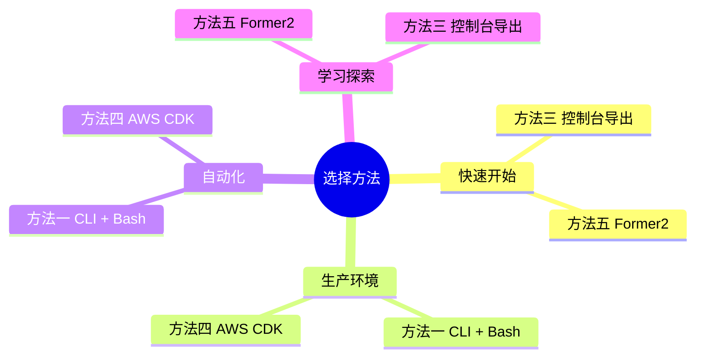

### 核心要点

1. **🥇 方法一（CLI + Bash）** - 适合 Glue 项目，本项目已提供完整实现
2. **🥈 方法四（AWS CDK）** - 复杂项目的长期解决方案
3. **🥉 方法五（Former2）** - 快速探索和学习的好选择
4. **统一输出** - 所有方法输出到 `cloudformation-export/cloudformation.yaml`
5. **最佳实践** - 参数化、标签化、文档化、测试化

### 下一步

1. 根据项目需求选择合适的方法
2. 参考本指南实施导出流程
3. 验证和测试生成的模板
4. 部署到目标环境
5. 持续优化和维护

### 获取帮助

- 📖 查看本项目其他文档: [docs/](../docs/)
- 🐛 提交问题: [GitHub Issues](../../issues)
- 💬 社区讨论: [GitHub Discussions](../../discussions)

---

**文档版本**: v1.0.0  
**最后更新**: 2024  
**作者**: AWS Glue Workflow Automation Team  
**许可**: MIT License

