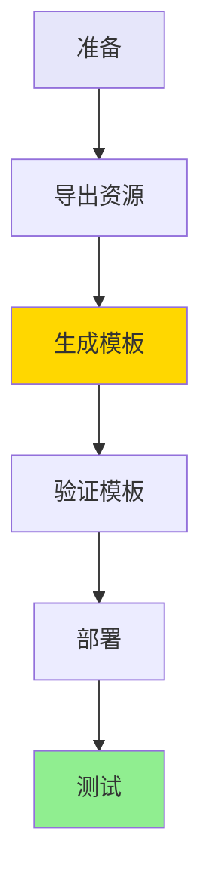

# AWS Glue 工作流自动化部署 - 使用指南

## 📋 目录

- [快速开始](#快速开始)
- [详细步骤](#详细步骤)
- [常见问题](#常见问题)
- [最佳实践](#最佳实践)

## 🚀 快速开始

### 环境要求

```bash
# 检查AWS CLI版本
aws --version  # 需要 >= 2.0

# 检查Bash版本
bash --version  # 需要 >= 4.0

# 配置AWS凭证
aws configure --profile <your-profile>
```

### 完整流程



## 📝 详细步骤

### 步骤1: 导出现有资源

```bash
# 基本用法
./scripts/export-glue-to-cloudformation.sh <工作流名称> <AWS配置> <区域>

# 示例
./scripts/export-glue-to-cloudformation.sh helloworld default us-east-1
```

**输出文件**：
```
cloudformation-export/
├── workflow.json                      # 工作流配置
├── job.json                          # 作业配置
├── trigger.json                      # 触发器配置
├── helloworld_job.py                 # Glue脚本
├── resource-summary.txt              # 资源摘要
└── generated-cloudformation.yaml     # CloudFormation模板
```

### 步骤2: 验证生成的模板

```bash
# 验证CloudFormation模板语法
aws cloudformation validate-template \
  --template-body file://cloudformation-export/generated-cloudformation.yaml

# 查看模板内容
cat cloudformation-export/generated-cloudformation.yaml
```

### 步骤3: 部署到目标账号

```bash
# 方式1: 使用AWS CLI直接部署
aws cloudformation deploy \
  --template-file cloudformation-export/generated-cloudformation.yaml \
  --stack-name glue-workflow-stack \
  --capabilities CAPABILITY_IAM \
  --profile <target-profile> \
  --region <target-region>

# 方式2: 使用部署脚本
./scripts/deploy-glue-stack.sh dev <target-profile> <target-region>
```

### 步骤4: 验证部署

```bash
# 查看堆栈状态
aws cloudformation describe-stacks \
  --stack-name glue-workflow-stack \
  --profile <target-profile>

# 查看创建的资源
aws glue get-workflow --name helloworld-dev --profile <target-profile>
```

### 步骤5: 启动工作流

```bash
# 启动工作流
aws glue start-workflow-run \
  --name helloworld-dev \
  --profile <target-profile>

# 查看运行状态
aws glue get-workflow-run \
  --name helloworld-dev \
  --run-id <run-id> \
  --profile <target-profile>
```

## 🔧 高级用法

### 多环境部署

```bash
# 开发环境
aws cloudformation deploy \
  --template-file cloudformation-export/generated-cloudformation.yaml \
  --stack-name glue-workflow-dev \
  --parameter-overrides Environment=dev

# 生产环境
aws cloudformation deploy \
  --template-file cloudformation-export/generated-cloudformation.yaml \
  --stack-name glue-workflow-prod \
  --parameter-overrides Environment=prod
```

### 自定义模板

生成的模板支持以下参数：

```yaml
Parameters:
  Environment:
    Type: String
    Default: dev
    AllowedValues: [dev, test, prod]
  
  ProjectName:
    Type: String
    Default: helloworld
```

## ❓ 常见问题

### Q1: 导出失败怎么办？

**检查清单**：
- ✅ AWS CLI 配置正确
- ✅ 具有 Glue 资源读取权限
- ✅ 工作流名称正确
- ✅ 区域设置正确

### Q2: 生成的模板缺少IAM角色？

生成的模板使用现有IAM角色ARN。部署到新账号时需要：
1. 在目标账号创建相同的IAM角色
2. 或修改模板中的Role ARN

### Q3: S3脚本无法访问？

确保：
- S3存储桶在目标账号存在
- 或将脚本上传到目标账号的S3
- 或使用完整模板（包含Lambda自动上传）

### Q4: 如何清理资源？

```bash
# 删除CloudFormation堆栈
aws cloudformation delete-stack \
  --stack-name glue-workflow-stack \
  --profile <target-profile>

# 等待删除完成
aws cloudformation wait stack-delete-complete \
  --stack-name glue-workflow-stack \
  --profile <target-profile>
```

## 🎯 最佳实践

### 1. 版本控制

```bash
# 将导出的配置纳入Git管理
git add cloudformation-export/
git commit -m "Export Glue workflow configuration"
```

### 2. 参数化配置

修改生成的模板，添加更多参数：

```yaml
Parameters:
  ScriptBucket:
    Type: String
    Description: S3存储桶名称
  
  GlueVersion:
    Type: String
    Default: "4.0"
    Description: Glue版本
```

### 3. 安全加固

- 使用最小权限IAM角色
- 启用S3加密
- 配置VPC网络隔离
- 启用CloudWatch日志

### 4. 监控告警

```bash
# 配置CloudWatch告警
aws cloudwatch put-metric-alarm \
  --alarm-name glue-job-failure \
  --alarm-description "Glue作业失败告警" \
  --metric-name JobRunsFailed \
  --namespace AWS/Glue \
  --statistic Sum \
  --period 300 \
  --threshold 1 \
  --comparison-operator GreaterThanThreshold
```

## 📊 性能优化

### Worker配置

根据数据量调整Worker配置：

```yaml
WorkerType: G.1X    # 小数据量
WorkerType: G.2X    # 中等数据量
WorkerType: G.4X    # 大数据量

NumberOfWorkers: 2-10  # 根据并行度调整
```

### 超时设置

```yaml
Timeout: 2880  # 默认48小时
MaxRetries: 0  # 失败重试次数
```

## 🔗 相关资源

- [AWS Glue 官方文档](https://docs.aws.amazon.com/glue/)
- [CloudFormation 用户指南](https://docs.aws.amazon.com/cloudformation/)
- [AWS CLI 参考](https://docs.aws.amazon.com/cli/)

---

**下一步**: 查看 [技术架构](ARCHITECTURE.md) 了解实现原理
