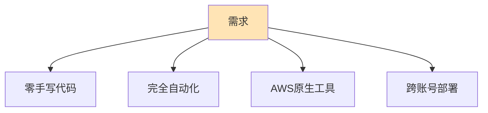
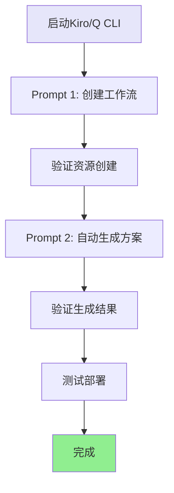

# 关键 Prompt 记录 v2 - 实验重现指南

## 🎯 项目目标

将现有 AWS Glue 工作流自动导出为 CloudFormation 模板，实现跨账号一键部署。

## 📝 核心需求



## 🔑 核心 Prompt 序列

### Prompt 1: 创建示例工作流

```
aws profile=oversea1, region=us-east-1

创建一个简单示例的glue workflows，叫helloworld，
用于演示glue最简流程与任务。
```

**预期输出**:
- Glue工作流: helloworld
- Glue作业: helloworld-job
- Glue触发器: helloworld-trigger
- PySpark脚本: helloworld_job.py

**验证命令**:
```bash
aws glue get-workflow --name helloworld
aws glue start-workflow-run --name helloworld
```

---

### Prompt 2: 自动生成CloudFormation方案

```
AWS Glue HelloWorld 工作流如何在当前AWS测试环境下，
将其完整打包为cloudformation脚本，以便在另一个AWS账号下进行一键部署。

要求：
1. 只考虑使用AWS原生方案
2. CloudFormation脚本自动生成，不希望写任何一句脚本
3. 输出文件夹"cloudformation-export"下要包含可直接部署的cloudformation.yaml文件

-- markdown文件中文输出结果与总结（用mermaid图方便阅读理解）
```

**预期输出**:
- 导出脚本: `export-glue-to-cloudformation.sh`
- 生成脚本: `generate-cloudformation-from-export.sh`
- CloudFormation模板: `generated-cloudformation.yaml`
- 完整文档和使用说明

**验证命令**:
```bash
# 执行导出和生成
./export-glue-to-cloudformation.sh helloworld oversea1 us-east-1

# 验证生成的模板
ls -la cloudformation-export/generated-cloudformation.yaml

# 验证模板语法
aws cloudformation validate-template \
  --template-body file://cloudformation-export/generated-cloudformation.yaml
```

---

## 🔄 完整实验流程

### 在 Kiro/Q CLI 环境中重现



