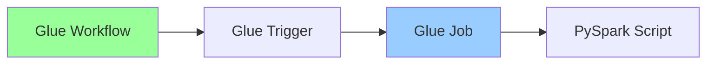

# HelloWorld 示例

## 📝 说明

这是一个最简单的 AWS Glue 工作流示例，用于演示自动化部署方案。

## 🏗️ 架构



## 📁 文件

- `helloworld_job.py` - PySpark脚本示例

## 🚀 快速开始

### 1. 创建工作流

```bash
# 创建工作流
aws glue create-workflow \
  --name helloworld \
  --description "Simple demo workflow"

# 创建作业
aws glue create-job \
  --name helloworld-job \
  --role <your-glue-role-arn> \
  --command Name=glueetl,ScriptLocation=s3://your-bucket/helloworld_job.py \
  --glue-version 4.0

# 创建触发器
aws glue create-trigger \
  --name helloworld-trigger \
  --type ON_DEMAND \
  --workflow-name helloworld \
  --actions JobName=helloworld-job
```

### 2. 导出配置

```bash
cd ../..
./scripts/export-glue-to-cloudformation.sh helloworld default us-east-1
```

### 3. 部署到新账号

```bash
aws cloudformation deploy \
  --template-file cloudformation-export/generated-cloudformation.yaml \
  --stack-name glue-helloworld \
  --capabilities CAPABILITY_IAM
```

## 📊 脚本说明

### helloworld_job.py

简单的PySpark脚本，功能：
- 创建示例DataFrame
- 输出"Hello World"消息
- 显示数据内容

```python
# 示例数据
data = [
    ("Hello", "World", 1),
    ("AWS", "Glue", 2),
    ("Demo", "Job", 3)
]
```

## 🔍 验证

```bash
# 启动工作流
aws glue start-workflow-run --name helloworld

# 查看运行状态
aws glue get-workflow --name helloworld

# 查看作业日志
aws logs tail /aws-glue/jobs/output --follow
```

## 🎯 预期结果

工作流成功运行后，在CloudWatch日志中应该看到：
```
Hello World from AWS Glue!
+-----+-----+---+
| col1| col2| id|
+-----+-----+---+
|Hello|World|  1|
|  AWS| Glue|  2|
| Demo|  Job|  3|
+-----+-----+---+
```

## 📝 注意事项

1. 需要预先创建IAM角色
2. S3存储桶需要存在
3. 确保有足够的Glue权限

---

**相关文档**: [使用指南](../../docs/GUIDE.md) | [技术架构](../../docs/ARCHITECTURE.md)
