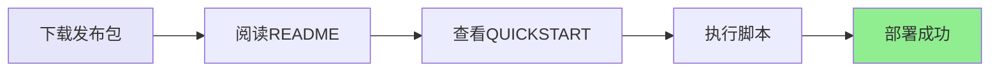
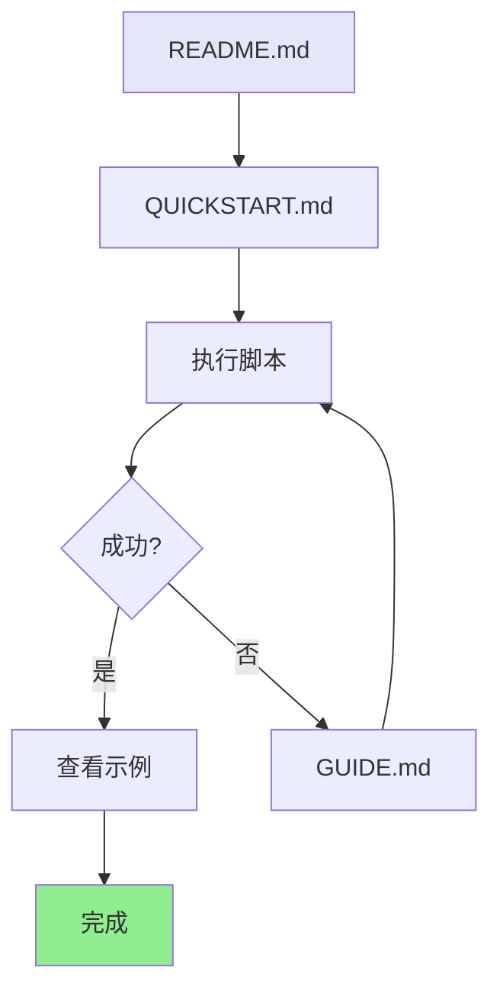
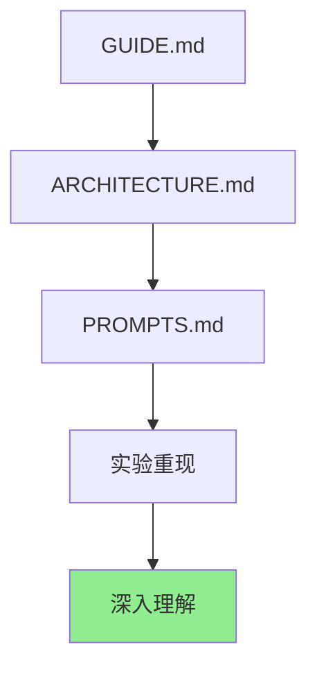
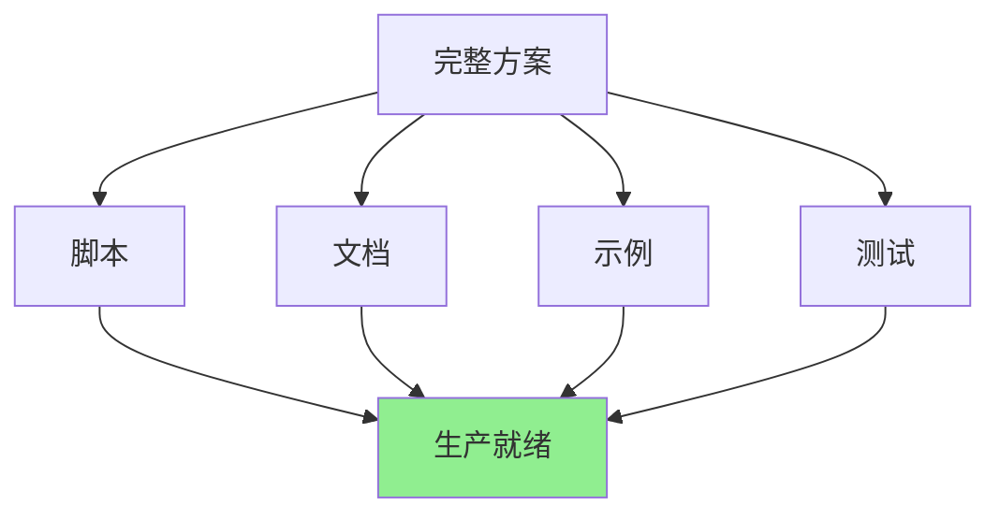

# GitHub 发布包说明

## 📦 发布内容

本目录包含完整的 AWS Glue 工作流自动化部署方案，可直接用于 GitHub 发布。

## 📁 目录结构

```
github-release/
├── 📄 README.md                    # 项目主页（GitHub首页）
├── 📄 QUICKSTART.md               # 5分钟快速开始指南
├── 📄 RELEASE_SUMMARY.md          # 发布总结
├── 📄 LICENSE                     # MIT开源许可证
├── 📄 发布说明.md                  # 本文档
│
├── 📂 scripts/                    # 核心脚本（5个文件）
│   ├── export-glue-to-cloudformation.sh      # 资源导出脚本
│   ├── generate-cloudformation-from-export.sh # 模板生成脚本
│   ├── deploy-glue-stack.sh                  # 部署脚本
│   ├── helloworld_job.py                     # 示例Glue脚本
│   └── glue-helloworld-cloudformation.yaml   # 完整模板示例
│
├── 📂 docs/                       # 详细文档（3个文件）
│   ├── GUIDE.md                  # 详细使用指南
│   ├── ARCHITECTURE.md           # 技术架构说明
│   └── PROMPTS.md                # Prompt重现指南
│
└── 📂 examples/                   # 示例代码
    └── helloworld/               # HelloWorld完整示例
        ├── README.md
        └── helloworld_job.py
```

## 🎯 核心文件说明

### 用户文档

| 文件 | 用途 | 目标读者 |
|------|------|---------|
| `README.md` | 项目介绍、快速开始 | 所有用户 |
| `QUICKSTART.md` | 5分钟快速上手 | 新用户 |
| `docs/GUIDE.md` | 详细使用说明 | 使用者 |
| `docs/ARCHITECTURE.md` | 技术实现原理 | 开发者 |
| `docs/PROMPTS.md` | Kiro/Q CLI重现 | 学习者 |

### 核心脚本

| 脚本 | 功能 | 输入 | 输出 |
|------|------|------|------|
| `export-glue-to-cloudformation.sh` | 导出资源 | 工作流名称 | JSON配置 |
| `generate-cloudformation-from-export.sh` | 生成模板 | JSON配置 | YAML模板 |
| `deploy-glue-stack.sh` | 部署堆栈 | YAML模板 | AWS资源 |

## 🚀 使用流程



### 步骤1: 获取代码

```bash
# 从GitHub下载
git clone <repository-url>
cd github-release

# 或下载Release压缩包
wget <release-url>
unzip aws-glue-automation-v1.0.0.zip
cd aws-glue-automation
```

### 步骤2: 快速开始

```bash
# 查看快速开始指南
cat QUICKSTART.md

# 执行导出
./scripts/export-glue-to-cloudformation.sh helloworld default us-east-1

# 部署
aws cloudformation deploy \
  --template-file cloudformation-export/generated-cloudformation.yaml \
  --stack-name glue-stack \
  --capabilities CAPABILITY_IAM
```

### 步骤3: 深入学习

```bash
# 阅读详细文档
cat docs/GUIDE.md
cat docs/ARCHITECTURE.md

# 学习Prompt重现
cat docs/PROMPTS.md
```

## 📊 文档阅读顺序

### 新用户推荐路径



1. **README.md** - 了解项目概况（5分钟）
2. **QUICKSTART.md** - 快速上手（10分钟）
3. **执行脚本** - 实际操作（5分钟）
4. **examples/helloworld** - 查看示例（可选）

### 深度学习路径



1. **docs/GUIDE.md** - 详细使用说明（30分钟）
2. **docs/ARCHITECTURE.md** - 技术架构（20分钟）
3. **docs/PROMPTS.md** - Prompt重现（30分钟）
4. **实验重现** - 在Kiro/Q CLI中重现（45分钟）

## 🎓 Kiro/Q CLI 实验重现

### 环境准备

```bash
# 1. 启动Kiro/Q CLI
kiro-cli chat

# 2. 配置AWS
aws configure --profile oversea1
```

### Prompt序列

按照 `docs/PROMPTS.md` 中的6个关键Prompt依次执行：

1. **Prompt 1**: 创建Glue工作流
2. **Prompt 2**: 分析打包方案
3. **Prompt 3**: 聚焦AWS原生
4. **Prompt 4**: 分析脚本原理
5. **Prompt 5**: 生成CloudFormation
6. **Prompt 6**: 准备发布

### 预期结果

完成后应该得到：
- ✅ 3个可执行脚本
- ✅ 完整的文档
- ✅ 可部署的CloudFormation模板
- ✅ 工作的示例

## 📈 项目特点

### 1. 完整性



- ✅ 核心脚本完整
- ✅ 文档详尽
- ✅ 示例可运行
- ✅ 经过验证

### 2. 易用性

- 📖 文档清晰
- 🚀 快速上手
- 💡 示例丰富
- 🔧 易于扩展

### 3. 可维护性

- 📝 代码注释完整
- 🏗️ 架构清晰
- 🔄 易于更新
- 🤝 欢迎贡献

## 🔗 GitHub 发布建议

### Release Notes 模板

```markdown
# AWS Glue 工作流自动化部署方案 v1.0.0

## 🎉 首次发布

完全基于 AWS 原生工具的 Glue 工作流自动化部署方案。

## ✨ 核心特性

- ⚡ 2分钟完成资源导出和模板生成
- 🎯 零手写CloudFormation代码
- 🔄 跨账号快速复制环境
- ✅ AWS原生无第三方依赖

## 📦 包含内容

- 3个核心脚本
- 完整文档（使用指南、技术架构、Prompt重现）
- HelloWorld示例
- MIT开源许可

## 🚀 快速开始

查看 [QUICKSTART.md](QUICKSTART.md)

## 📖 完整文档

- [使用指南](docs/GUIDE.md)
- [技术架构](docs/ARCHITECTURE.md)
- [Prompt重现](docs/PROMPTS.md)

## 🙏 致谢

感谢所有贡献者和AWS社区的支持！
```

### 标签建议

- `aws`
- `glue`
- `cloudformation`
- `automation`
- `infrastructure-as-code`
- `devops`
- `aws-cli`

## 📝 维护说明

### 版本规划

- **v1.0.0**: 初始发布（当前）
- **v1.1.0**: 支持更多资源类型（Crawler、Connection）
- **v1.2.0**: 增强模板功能（自动IAM、S3）
- **v2.0.0**: 支持其他AWS服务

### 贡献指南

欢迎提交：
- 🐛 Bug报告
- 💡 功能建议
- 📖 文档改进
- 🔧 代码贡献

## ✅ 发布检查清单

- [x] 所有脚本可执行
- [x] 文档完整准确
- [x] 示例可运行
- [x] LICENSE文件
- [x] README清晰
- [x] 目录结构合理

## 🎉 总结

本发布包包含：
- **5个脚本文件** - 核心功能
- **5个文档文件** - 完整说明
- **1个示例** - 可运行演示
- **1个许可证** - MIT开源

**总计**: 12个文件，完整的端到端解决方案！

---

**准备发布**: 将 `github-release/` 目录内容推送到GitHub仓库即可！
